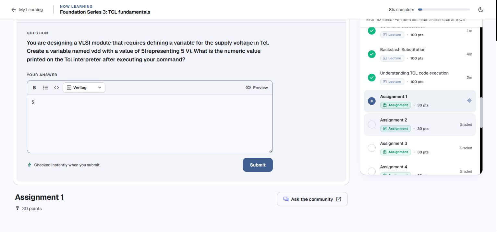
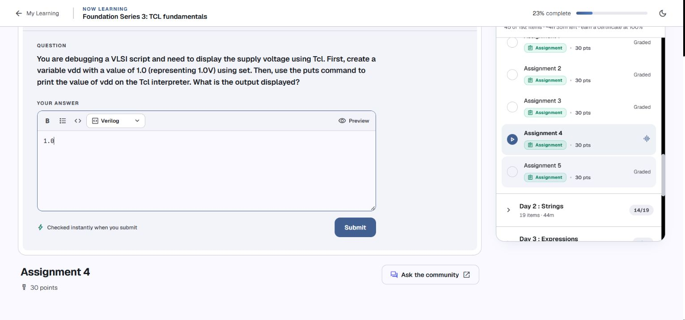
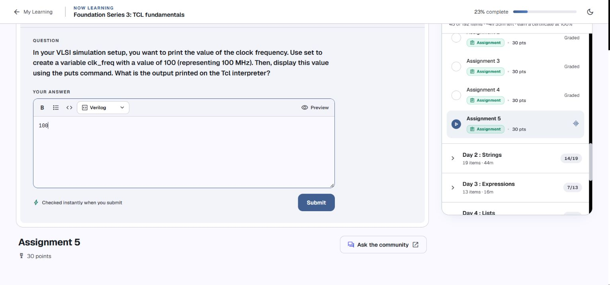
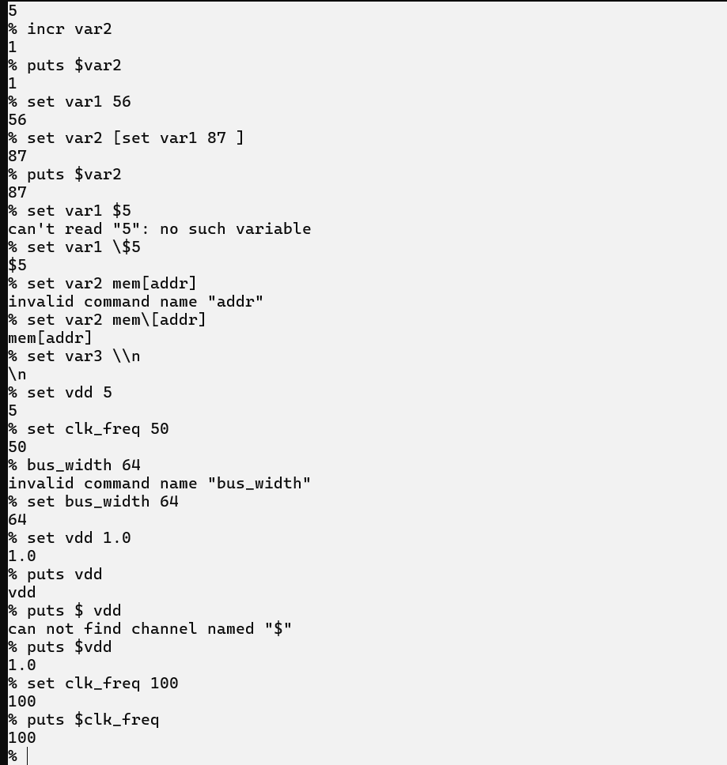

# Day 1 — Assignment review

**Kapil’s five solutions · reviewed 4 October 2026 · Tcl 8.6.18**

All five final solutions visible in your console screenshots are correct. Assignments 3 and 4 include earlier unsuccessful attempts, followed by correct commands. The review preserves those final solutions and explains the corrections you already made.

The five questions were opened in your [Namaste FPGA course](https://namaste-fpga.com/student/learn/37?contentId=1801) in Chrome and compared with your screenshots. Following your request to fill Days 1–3, their numeric answers have now been entered in dedicated Chrome tabs for review. Nothing has been submitted and no grade has been obtained. The course’s “Graded” label describes the assignment type; it is not evidence that your work has been graded.

## Contents

- [Results at a glance](#results-at-a-glance)
- [Assignment 1: supply voltage](#assignment-1-supply-voltage)
- [Assignment 2: clock frequency](#assignment-2-clock-frequency)
- [Assignment 3: bus width](#assignment-3-bus-width)
- [Assignment 4: print the supply voltage](#assignment-4-print-the-supply-voltage)
- [Assignment 5: print the clock frequency](#assignment-5-print-the-clock-frequency)
- [Your console evidence](#your-console-evidence)
- [What to revisit before Day 2](#what-to-revisit-before-day-2)

## Results at a glance

| Assignment | Requested operation | Your final solution | Numeric answer | Review |
| --- | --- | --- | --- | --- |
| 1 | Set the supply voltage to 5 V. | `set vdd 5` | `5` | Correct |
| 2 | Set the clock frequency to 50 MHz. | `set clk_freq 50` | `50` | Correct |
| 3 | Set the bus width to 64 bits. | `set bus_width 64` | `64` | Correct after your correction |
| 4 | Set the supply voltage to 1.0 V and print it. | `set vdd 1.0` then `puts $vdd` | `1.0` | Correct after your correction |
| 5 | Set the clock frequency to 100 MHz and print it. | `set clk_freq 100` then `puts $clk_freq` | `100` | Correct |

The course shows **numeric answer expected** for each question. The numeric answer column gives the value asked for; the code below explains how you obtained it. Keep `1.0` as displayed for Assignment 4. Review and submit the answers yourself when ready.

## Assignment 1: supply voltage



**Problem:** Create `vdd` with value `5`, representing the supply voltage, and identify the value displayed by the interactive interpreter.

**Your solution — correct, preserved:**

```tcl
set vdd 5
```

Interactive result:

```text
5
```

Your screenshot shows this exact command and result. `set` stores `5` and returns `5`; the interactive shell displays the return value. No extra `puts` is required by this question. [Official `set` behavior](https://www.tcl-lang.org/man/tcl8.6/TclCmd/set.htm).

**Answer to the question: `5`.**

## Assignment 2: clock frequency


**Problem:** Create `clk_freq` with value `50`, representing 50 MHz, and identify the interpreter’s displayed result.

**Your solution — correct, preserved:**

```tcl
set clk_freq 50
```

Interactive result:

```text
50
```

The screenshot contains this command and result. Your later assignment to `100` does not change the result that this command produced earlier; it only replaces the variable’s value for subsequent commands.

**Answer to the question: `50`.**

## Assignment 3: bus width


**Problem:** Create `bus_width` with value `64`, representing a 64-bit bus, and identify the interpreter’s displayed result.

**Your final solution — correct, preserved:**

```tcl
set bus_width 64
```

Interactive result:

```text
64
```

Your earlier attempt was:

```tcl
bus_width 64
```

It produced:

```text
invalid command name "bus_width"
```

The first word of a Tcl command must name a command. Tcl therefore looked for a command named `bus_width`. Adding `set` made `bus_width` the variable-name argument instead. You already fixed this in the screenshot; no further correction is needed.

**Answer to the question: `64`.**

## Assignment 4: print the supply voltage



**Problem:** Set `vdd` to `1.0`, representing 1.0 V, then print its value with `puts`.

**Your final solution — correct, preserved:**

```tcl
set vdd 1.0
puts $vdd
```

Output from `puts`:

```text
1.0
```

In the interactive console, `set` also displays its return value `1.0`. The question asks for the output printed by `puts`, which is the same text. As a saved script, these two lines print `1.0` once.

Your earlier attempts explain the distinction between a name and a value:

| Attempt | Observed result | Explanation |
| --- | --- | --- |
| `puts vdd` | `vdd` | Printed the literal word rather than reading the variable. |
| `puts $ vdd` | `can not find channel named "$"` | The space made `$` and `vdd` separate arguments; `$` was interpreted as a channel name. |
| `puts $vdd` | `1.0` | Substituted the variable’s value and printed it. |

You corrected both earlier attempts yourself. Keep the final `$vdd` form, with no space between `$` and `vdd`. [Official `puts` syntax](https://www.tcl-lang.org/man/tcl8.6/TclCmd/puts.htm).

**Answer to the question: `1.0`.**

## Assignment 5: print the clock frequency



**Problem:** Set `clk_freq` to `100`, representing 100 MHz, then print its value with `puts`.

**Your solution — correct, preserved:**

```tcl
set clk_freq 100
puts $clk_freq
```

Output from `puts`:

```text
100
```

Both commands and their results are visible at the end of your second console screenshot. As with Assignment 4, the interactive shell displays the `set` result as well, whereas a saved script prints only the explicit `puts` output.

**Answer to the question: `100`.**

## Your console evidence



This original screenshot contains all five final solutions. It also preserves the unsuccessful attempts for Assignments 3 and 4, so the explanations above can be checked against what you actually typed.

Your wider Day 1 practice, including variable naming, `${res}6`, `incr`, command substitution, and escaping special characters, is documented in [Day 1 Code](Day%201%20Code.md#your-original-practice).

## What to revisit before Day 2

No assignment solution is missing from the supplied screenshots. The useful follow-up is to make the underlying syntax familiar:

- **Command versus variable:** `set bus_width 64` uses `set` as the command and `bus_width` as the name. A name alone does not perform assignment.
- **Name versus value:** write `vdd` when assigning and `$vdd` when reading its value for `puts`.
- **Interactive result versus printed output:** the console displays the return value of `set`; scripts need explicit `puts` for visible output.
- **Deleting a variable:** the Day 1 outline includes `unset`, but it is not demonstrated in your screenshots. The [notes include a short example](Day%201%20Code.md#missing-from-the-screenshots-unset-and-execution-order).
- **Grouping and literal characters:** the first Day 2 lessons on quotes and braces connect directly to your `$5`, `[addr]`, and `\n` practice. The [Day 2 bridge](Day%201%20Code.md#a-short-bridge-to-day-2) explains that connection.

The five results were verified in fresh Tcl 8.6.18 interpreters. This is a local correctness review, with submission and the course’s final grading left to you.

[Return to contents](#contents) · [Open Day 1 code and notes](Day%201%20Code.md)
