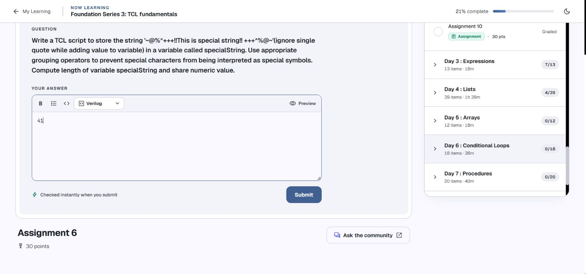
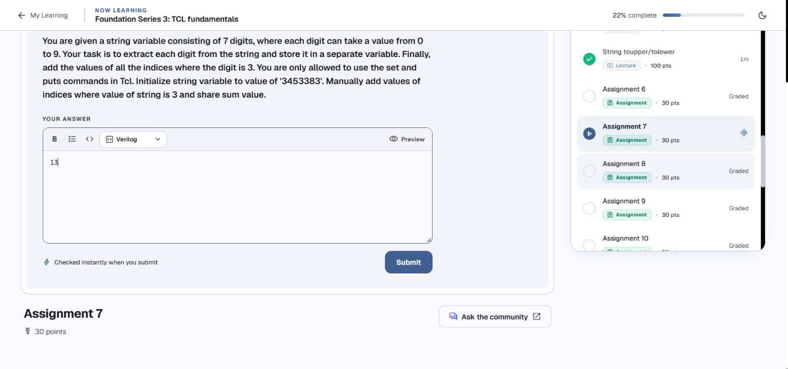
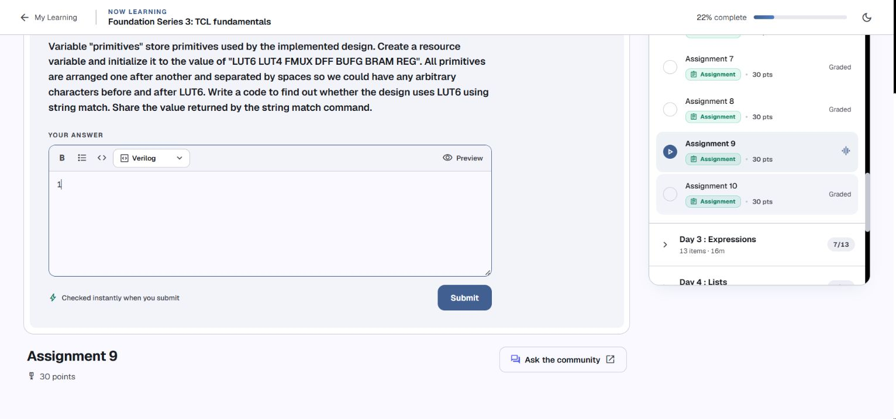
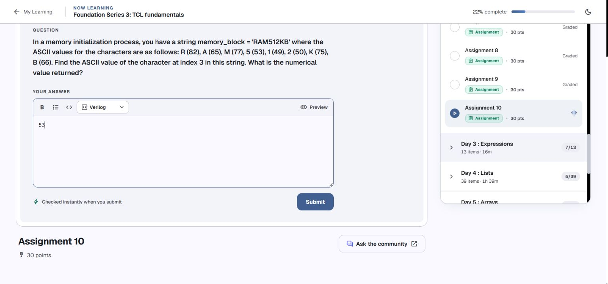

# Day 2 — Assignment review and drafts

[← Back to index](../README.md#day-2-assignments) · [Code and notes](../codes/day-2.md)

**Reviewed 4 October 2026 · Tcl 8.6.18 · drafts entered, not submitted**

These questions were read in your [Namaste FPGA course](https://namaste-fpga.com/student/learn/37?contentId=1801) and compared with your [console session](../codes/console-session.txt). Each numeric answer was entered in its own Chrome tab for you to review and submit. The screenshots below show the actual filled drafts. The scripts were checked locally in Tcl 8.6.18.

For the lesson concepts and your earlier syntax errors, see [Day 2 Code](../codes/day-2.md).

## Contents

- [Drafts at a glance](#drafts-at-a-glance)
- [Assignment 6: Exact special string and its length](#assignment-6-exact-special-string-and-its-length)
- [Assignment 7: Digits equal to 3: sum their indices](#assignment-7-digits-equal-to-3-sum-their-indices)
- [Assignment 8: Compare parameter values with string equal](#assignment-8-compare-parameter-values-with-string-equal)
- [Assignment 9: Find LUT6 with string match](#assignment-9-find-lut6-with-string-match)
- [Assignment 10: ASCII value at index 3](#assignment-10-ascii-value-at-index-3)

## Drafts at a glance

| Assignment | Numeric draft | Review of your console work |
| --- | --- | --- |
| 6 | `41` | Corrected the input; 39 becomes 41 |
| 7 | `13` | Completed the digit variables and index sum |
| 8 | `0` | Kept 0; corrected the compared operands |
| 9 | `1` | Preserved the working pattern and result 1 |
| 10 | `53` | Completed character 5 to ASCII value 53 |

The course requests numeric answers, so the entered field contains the number. The complete code is rendered below each question for your study and review.

[← Back to index](../README.md#day-2-assignments) · [This day’s contents](#contents)

## Assignment 6: Exact special string and its length



**Problem:** Store the exact supplied text in `specialString`, protect literal content with grouping, and return its length. Ignore the quotation marks used to describe the value in the question.

**Your work:** Corrected the input; 39 becomes 41.

**Complete solution:**

```tcl
set specialString {~@%^+++!!This is special string!! +++^%@~}
puts [string length $specialString]
```

**Output and entered numeric draft:**

```text
41
```

The exact value is:

```text
~@%^+++!!This is special string!! +++^%@~
```

Your pasted command stored:

```text
~@%^+++!!This is special string!!+++^@~
```

Your `39` was the correct length of that shorter string. The question adds a space after the second `!!` and a `%` before the final `@`, adding two characters. Braces store the supplied text literally, and `string length` returns `41`. Escaping `@` did not fix the transcription difference, because `@` already behaves as ordinary text here.

[← Back to index](../README.md#day-2-assignments) · [This day’s contents](#contents)

## Assignment 7: Digits equal to 3: sum their indices



**Problem:** Use the fixed seven-digit string `3453383`, put each digit in a separate variable, and manually sum the indices containing `3`. The permitted executable commands are only `set` and `puts`.

**Your work:** Completed the digit variables and index sum.

**Complete solution:**

```tcl
set digits 3453383
set digit0 3
set digit1 4
set digit2 5
set digit3 3
set digit4 3
set digit5 8
set digit6 3
# Matching indices: 0, 3, 4, 6. Their manually calculated sum is 13.
set index_sum 13
puts $index_sum
```

**Output and entered numeric draft:**

```text
13
```

Tcl string positions begin at zero:

| Index | 0 | 1 | 2 | 3 | 4 | 5 | 6 |
| --- | --- | --- | --- | --- | --- | --- | --- |
| Digit | 3 | 4 | 5 | 3 | 3 | 8 | 3 |
| Equals 3? | Yes | No | No | Yes | Yes | No | Yes |

The matching indices are `0`, `3`, `4`, and `6`; their manual sum is `13`. This sums indices, rather than the four matching digit values, whose sum would be `12`.

Your `set var1 '3453383'` included the apostrophes in the stored value. The completed solution stores the seven digits without apostrophes and assigns the seven digit variables manually for this fixed input. Every executable line uses `set` or `puts`; the addition is calculated manually, as the problem requests.

[← Back to index](../README.md#day-2-assignments) · [This day’s contents](#contents)

## Assignment 8: Compare parameter values with string equal


**Problem:** Set `param1` to `LowPower` and `param2` to `HighPerformance`, without the descriptive apostrophes, then return the result of `string equal`.

**Your work:** Kept 0; corrected the compared operands.

**Complete solution:**

```tcl
set param1 LowPower
set param2 HighPerformance
puts [string equal $param1 $param2]
```

**Output and entered numeric draft:**

```text
0
```

Your `string equal param1 param2` returned `0`, but it compared the literal names. The desired test reads the stored values using `$param1` and `$param2`. Those values are different too, so the correct answer is still `0`.

Your single-quoted declarations also stored literal apostrophes. The clean declarations above use the exact values requested. `string compare $param1 $param2` would return `1` for their ordering; the question asks for `string equal`, whose result is `0`. A matching final number does not by itself prove that the intended operands were used.

[← Back to index](../README.md#day-2-assignments) · [This day’s contents](#contents)

## Assignment 9: Find LUT6 with string match



**Problem:** Store `LUT6 LUT4 FMUX DFF BUFG BRAM REG` as the resource string and use `string match` to test whether it contains `LUT6`, allowing arbitrary text before and after it.

**Your work:** Preserved the working pattern and result 1.

**Complete solution:**

```tcl
set primitives {LUT6 LUT4 FMUX DFF BUFG BRAM REG}
puts [string match {*LUT6*} $primitives]
```

**Output and entered numeric draft:**

```text
1
```

Your final `string match *LUT6* $value` returned `1` and satisfies the requested match. The clean version uses `primitives` as the resource variable; it preserves your pattern and result.

Each `*` accepts any number of characters, including zero. Your earlier `?LUT6?` permits exactly one character on either side, so it cannot match this whole resources string. `string match ?primitives?` was missing the input-string argument. The course asks for this substring pattern test, so the complete resources string is tested against `*LUT6*`.

[← Back to index](../README.md#day-2-assignments) · [This day’s contents](#contents)

## Assignment 10: ASCII value at index 3



**Problem:** For `RAM512KB`, read the character at zero-based index `3` and report its ASCII value using the mapping supplied in the question.

**Your work:** Completed character 5 to ASCII value 53.

**Complete solution:**

```tcl
set memory_block RAM512KB
set character [string index $memory_block 3]
set ascii_value [scan $character %c]
puts $ascii_value
```

**Output and entered numeric draft:**

```text
53
```

The character trace is:

| Index | 0 | 1 | 2 | 3 | 4 | 5 | 6 | 7 |
| --- | --- | --- | --- | --- | --- | --- | --- | --- |
| Character | R | A | M | 5 | 1 | 2 | K | B |

Your corrected `string index $memory_block 3` returned the character `5`. The requested number is its ASCII value, `53`. `scan $character %c` returns the character code; for this ASCII character, that code is `53`.

The earlier single-quoted value shifted the indices, producing `M` at index `3`. Reversing the `string index` arguments produced a bad-index error, while omitting `$` read the literal word `memory_block` and returned `o`. Your final lookup fixed those errors; the character-code conversion completes the remaining part of the question.

[← Back to index](../README.md#day-2-assignments) · [This day’s contents](#contents)

## References and review

The original questions and numeric-answer format come from the course linked above. Command behavior was checked against the official Tcl 8.6 manuals for [string](https://www.tcl-lang.org/man/tcl8.6/TclCmd/string.htm) and [scan](https://www.tcl-lang.org/man/tcl8.6/TclCmd/scan.htm).

The screenshots record the filled, unsubmitted drafts at review time. Review the values and code before using the course’s Submit button yourself.

[← Back to index](../README.md#day-2-assignments) · [This day’s contents](#contents)
