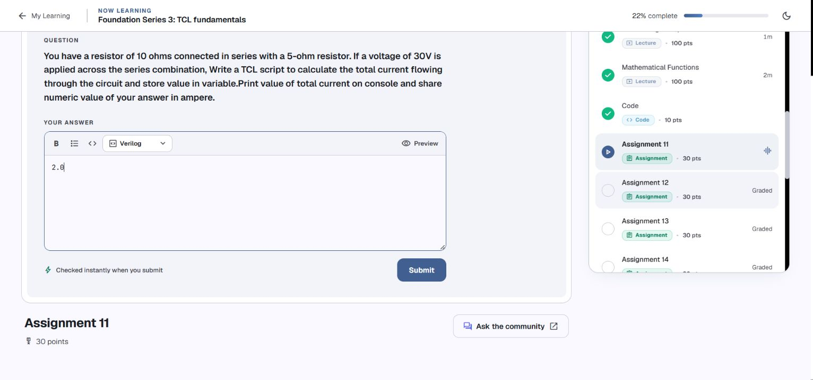
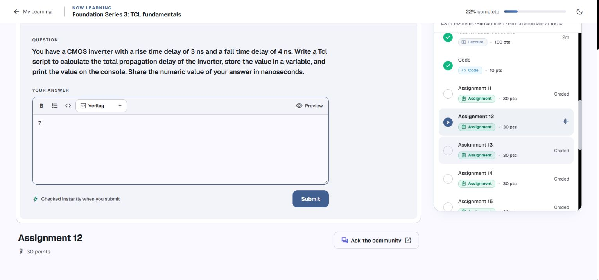

# Day 3 — Assignment review and drafts

[← Back to index](../README.md#day-3-assignments) · [Code and notes](../codes/day-3.md)

**Reviewed 4 October 2026 · Tcl 8.6.18 · drafts entered, not submitted**

These questions were read in your [Namaste FPGA course](https://namaste-fpga.com/student/learn/37?contentId=1801) and compared with your [console session](../codes/console-session.txt). Each numeric answer was entered in its own Chrome tab for you to review and submit. The screenshots below show the actual filled drafts. The scripts were checked locally in Tcl 8.6.18.

For the lesson concepts and your earlier syntax errors, see [Day 3 Code](../codes/day-3.md).

## Contents

- [Drafts at a glance](#drafts-at-a-glance)
- [Assignment 11: Current through series resistors](#assignment-11-current-through-series-resistors)
- [Assignment 12: Rise and fall delays: requested total](#assignment-12-rise-and-fall-delays-requested-total)
- [Assignment 13: Power in milliwatts](#assignment-13-power-in-milliwatts)
- [Assignment 14: Period of a 200 MHz clock](#assignment-14-period-of-a-200-mhz-clock)
- [Assignment 15: Transistor count for four full adders](#assignment-15-transistor-count-for-four-full-adders)
- [Assignment 16: RC transition time: convert, then round](#assignment-16-rc-transition-time-convert-then-round)

## Drafts at a glance

| Assignment | Numeric draft | Review of your console work |
| --- | --- | --- |
| 11 | `2.0` | Corrected 450 to 2.0 amperes |
| 12 | `7` | Kept 7 under the stated total interpretation |
| 13 | `9.0` | Preserved 9.0 milliwatts |
| 14 | `5.0` | Completed; no attempt appears in the pasted session |
| 15 | `112` | Completed; no attempt appears in the pasted session |
| 16 | `1` | Completed; no attempt appears in the pasted session |

The course requests numeric answers, so the entered field contains the number. The complete code is rendered below each question for your study and review.

[← Back to index](../README.md#day-3-assignments) · [This day’s contents](#contents)

## Assignment 11: Current through series resistors



**Problem:** Calculate current through series resistors of 10 ohms and 5 ohms with 30 V across the combination. Store and print the result in amperes.

**Your work:** Corrected 450 to 2.0 amperes.

**Complete solution:**

```tcl
set resistance1 10
set resistance2 5
set totalr [expr {$resistance1 + $resistance2}]
set voltage 30.0
set total_current [expr {$voltage / $totalr}]
puts $total_current
```

**Output and entered numeric draft:**

```text
2.0
```

The series resistance is $R_{\mathrm{total}}=10+5=15\thinspace\mathrm{\Omega}$. Ohm's law gives:

$$
I=\frac{V}{R_{\mathrm{total}}}=\frac{30}{15}=2\thinspace\mathrm{A}.
$$

Your final expression `$voltage * $totalr` was valid Tcl multiplication, but it produced `450` using the wrong formula for current. Divide voltage by total resistance. Setting the voltage to `30.0` makes the division floating point, yielding `2.0`.

Your earlier bracket-only forms tried to execute `voltage` or `30` as a command. The completed expression explicitly calls `expr`, stores its result in `total_current`, and then prints it.

[← Back to index](../README.md#day-3-assignments) · [This day’s contents](#contents)

## Assignment 12: Rise and fall delays: requested total



**Problem:** The question gives 3 ns and 4 ns and asks for their total propagation delay, stored in a variable and printed in nanoseconds.

**Your work:** Kept 7 under the stated total interpretation.

**Complete solution:**

```tcl
set rise 3
set fall 4
set propdelay [expr {$rise + $fall}]
puts $propdelay
```

**Output and entered numeric draft:**

```text
7
```

Your final addition returns `7`, and the draft preserves it. The braced expression in the complete code performs the same calculation as your working unbraced `expr` call.

**Review point:** this draft interprets the question's word “total” as the sum of the two given values. Their arithmetic average would be `3.5`; the question does not specify an average convention. The sum interpretation is recorded explicitly for your review, and no course grade has been obtained.

Your earlier `puts propdelay ...` treated `propdelay` as an output channel. After `unset propdelay`, `$propdelay` could not be read until you assigned it again. Store using the name `propdelay`, then print its value using `$propdelay`.

[← Back to index](../README.md#day-3-assignments) · [This day’s contents](#contents)

## Assignment 13: Power in milliwatts


**Problem:** Calculate power for a 1.8 V supply and 5 mA current, store and print the result, and report milliwatts.

**Your work:** Preserved 9.0 milliwatts.

**Complete solution:**

```tcl
set supply 1.8
set current 5
set powerdissipation [expr {$current * $supply}]
puts $powerdissipation
```

**Output and entered numeric draft:**

```text
9.0
```

Your final expression is correct:

$$
P=VI=1.8\thinspace\mathrm{V}\times5\thinspace\mathrm{mA}=9\thinspace\mathrm{mW}.
$$

The numeric current `5` represents milliamperes in this script, so the resulting `9.0` is in milliwatts. Converting current to amperes would give `0.009` watts, which is the same power in a different unit. The question requests milliwatts, so `9.0` is the draft.

Your earlier expression `{current * supply}` used bare words. Adding the dollar signs made `expr` read the stored numeric values; that correction is preserved.

[← Back to index](../README.md#day-3-assignments) · [This day’s contents](#contents)

## Assignment 14: Period of a 200 MHz clock


**Problem:** Calculate the period of a 200 MHz clock, store and print it, and report nanoseconds.

**Your work:** Completed; no attempt appears in the pasted session.

**Complete solution:**

```tcl
set frequency_mhz 200.0
set period_ns [expr {1000.0 / $frequency_mhz}]
puts $period_ns
```

**Output and entered numeric draft:**

```text
5.0
```

Using the frequency in megahertz, the period in nanoseconds is:

$$
T_{\mathrm{ns}}=\frac{1000}{f_{\mathrm{MHz}}}=\frac{1000}{200}=5\thinspace\mathrm{ns}.
$$

The conversion factor carries the MHz-to-nanosecond relationship. A bare `1 / 200` with integer operands would return `0`, and would also omit the requested unit conversion. The complete calculation uses `1000.0 / 200.0` and produces `5.0` nanoseconds.

[← Back to index](../README.md#day-3-assignments) · [This day’s contents](#contents)

## Assignment 15: Transistor count for four full adders


**Problem:** Use the problem's count of 28 transistors per full adder and four full adders in the ripple-carry adder. Store and print the integer total.

**Your work:** Completed; no attempt appears in the pasted session.

**Complete solution:**

```tcl
set transistors_per_adder 28
set full_adders 4
set transistor_total [expr {$transistors_per_adder * $full_adders}]
puts $transistor_total
```

**Output and entered numeric draft:**

```text
112
```

Using the count supplied by the question:

$$
N=28\times4=112.
$$

The multiplication returns an integer because both inputs are integers. The code stores that result in `transistor_total` before printing it, meeting both requirements in the question.

[← Back to index](../README.md#day-3-assignments) · [This day’s contents](#contents)

## Assignment 16: RC transition time: convert, then round


**Problem:** Use the supplied formula with 500 ohms and 2 picofarads, calculate the time in nanoseconds, and round that result to the nearest integer.

**Your work:** Completed; no attempt appears in the pasted session.

**Complete solution:**

```tcl
set resistance 500.0
set capacitance_f 2e-12
set transition_s [expr {$resistance * $capacitance_f * log(2.0)}]
set transition_ns [expr {$transition_s * 1e9}]
set rounded_ns [expr {round($transition_ns)}]
puts $rounded_ns
```

**Output and entered numeric draft:**

```text
1
```

The specified formula is $T=RC\ln(2)$. Convert the capacitance to farads before using resistance in ohms:

$$
T=500\times(2\times10^{-12})\times\ln(2)\thinspace\mathrm{s}.
$$

The unrounded result is about `0.693147` nanoseconds. Rounding in the requested unit gives `1` nanosecond. Tcl's `log(2.0)` is the natural logarithm; `round` returns the nearest integer.

The order matters: round the nanosecond value, rather than the tiny value expressed in seconds. Multiplying the numbers `500` and `2` without the picofarad conversion would also produce a result in the wrong unit.

[← Back to index](../README.md#day-3-assignments) · [This day’s contents](#contents)

## References and review

The original questions and numeric-answer format come from the course linked above. Command behavior was checked against the official Tcl 8.6 manuals for [expr](https://www.tcl-lang.org/man/tcl8.6/TclCmd/expr.htm) and [mathematical functions](https://www.tcl-lang.org/man/tcl8.6/TclCmd/mathfunc.htm).

The screenshots record the filled, unsubmitted drafts at review time. Review the values and code before using the course’s Submit button yourself.

[← Back to index](../README.md#day-3-assignments) · [This day’s contents](#contents)
