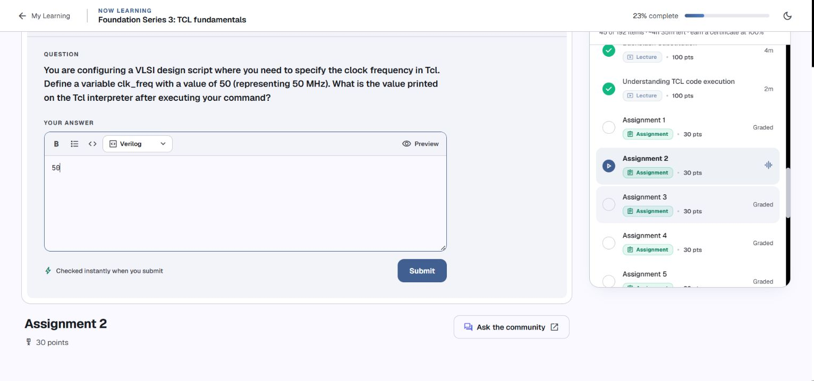
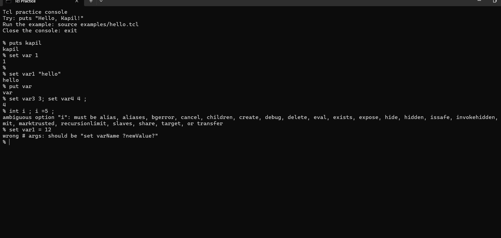

# Day 1 — Tcl variables: notes, code, and assignments

[← Back to index](README.md#day-1) · [Runnable Day 1 script](internal/scripts/day-1.tcl)

**Kapil’s practice · reviewed 4 October 2026 · Tcl 8.6.18**

Your five final assignment solutions are correct. This page preserves your console practice, explains the visible errors, and adds the missing Day 1 examples. Assignments 1–5 appear directly under the lesson on their variable commands.

Source: [Namaste FPGA Tcl course](https://namaste-fpga.com/student/learn/37?contentId=1801), your original console screenshots, and the [pasted console session](internal/sources/console-session.txt). The screenshots record the filled drafts at review time. No assignment was submitted by Codex; review and submission remain your step. The course’s “Graded” label describes the assignment type; it does not show that these drafts have been graded.

## Contents

- [Results at a glance](#results-at-a-glance)
- [Your original practice](#your-original-practice)
- [Commands, values, and output](#commands-values-and-output)
- [Variable names and substitution](#variable-names-and-substitution)
- [Incrementing variables](#incrementing-variables)
- [Command substitution](#command-substitution)
- [Backslashes and literal text](#backslashes-and-literal-text)
- [The five assignment commands](#the-five-assignment-commands)
  - [Assignment 1: supply voltage](#assignment-1-supply-voltage)
  - [Assignment 2: clock frequency](#assignment-2-clock-frequency)
  - [Assignment 3: bus width](#assignment-3-bus-width)
  - [Assignment 4: print the supply voltage](#assignment-4-print-the-supply-voltage)
  - [Assignment 5: print the clock frequency](#assignment-5-print-the-clock-frequency)
- [Earlier errors: assignment syntax and abbreviations](#earlier-errors-assignment-syntax-and-abbreviations)
- [Missing from the screenshots: unset and execution order](#missing-from-the-screenshots-unset-and-execution-order)
- [Save scripts and write comments](#save-scripts-and-write-comments)
- [A short bridge to Day 2](#a-short-bridge-to-day-2)
- [Complete practice script](#complete-practice-script)
- [Verification and references](#verification-and-references)
- [Your console evidence](#your-console-evidence)
- [What to revisit before Day 2](#what-to-revisit-before-day-2)

## Results at a glance

| Assignment | Requested operation | Your final solution | Numeric answer | Review |
| --- | --- | --- | --- | --- |
| [1](#assignment-1-supply-voltage) | Set the supply voltage to 5 V. | `set vdd 5` | `5` | Correct |
| [2](#assignment-2-clock-frequency) | Set the clock frequency to 50 MHz. | `set clk_freq 50` | `50` | Correct |
| [3](#assignment-3-bus-width) | Set the bus width to 64 bits. | `set bus_width 64` | `64` | Correct after your correction |
| [4](#assignment-4-print-the-supply-voltage) | Set the supply voltage to 1.0 V and print it. | `set vdd 1.0` then `puts $vdd` | `1.0` | Correct after your correction |
| [5](#assignment-5-print-the-clock-frequency) | Set the clock frequency to 100 MHz and print it. | `set clk_freq 100` then `puts $clk_freq` | `100` | Correct |

The course shows **numeric answer expected** for each question. The numeric answer column gives the value asked for; the code below explains how you obtained it. Keep `1.0` as displayed for Assignment 4. Review and submit the answers yourself when ready.

[← Back to index](README.md#day-1) · [Day contents](#contents)

## Your original practice

### Screenshot 1 — variables, increments, and substitutions


The console begins with `set var2_3 23` and continues through the assignment variables. The `%` characters are interpreter prompts. The lines beneath commands are results or output; neither belongs in a saved script.

### Screenshot 2 — continuation and the five assignments


The screenshots overlap. Read them as two views of the same sequence of practice, rather than two separate sets of assignments. The second view includes your final `puts $vdd` and `puts $clk_freq` results.

[← Back to index](README.md#day-1) · [Day contents](#contents)

## Commands, values, and output

Tcl commands follow this shape:

```text
command argument1 argument2 ...
```

For your command `set vdd 5`, the first word is the command `set`, the second word names the variable, and the third supplies its value. Spaces separate words. A newline or `;` separates commands. Tcl processes substitutions while preparing the words, then calls the command. [Official Tcl syntax](https://www.tcl-lang.org/man/tcl8.6/TclCmd/Tcl.htm#M6).

```tcl
set vdd 5
set clk_freq 50
set bus_width 64
```

`set` both stores a value and returns it. With only a variable name, `set` reads its current value:

```tcl
set vdd 5
set vdd
puts $vdd
```

In the interactive console, the first two commands each show `5` because the shell displays their nonempty results. The third explicitly writes `5` to the output channel. In a saved script, `set vdd 5` alone does not print anything; use `puts` when you want visible output. [Official `set` manual](https://www.tcl-lang.org/man/tcl8.6/TclCmd/set.htm).

The course calls Tcl a string based language. For these exercises, a variable holds a value without an `int` or `float` declaration. Commands decide how to interpret that value: `puts` prints it, while `incr` requires an integer. Tcl can maintain internal numeric representations; “string based” does not mean every operation is merely text concatenation.

`vdd`, `clk_freq`, and `bus_width` are ordinary variable names here. The units come from the problem description. Setting `vdd` does not configure a physical supply, and setting `clk_freq` does not create a Vivado clock constraint.

[← Back to index](README.md#day-1) · [Day contents](#contents)

## Variable names and substitution

Your first pair is correct:

```tcl
set var2_3 23
puts $var2_3
```

Output from `puts`:

```text
23
```

The underscore is part of the name. Use the name without `$` when assigning it; use `$var2_3` when reading its value inside another command. Names are case sensitive: `vdd` and `VDD` are different variables.

Your next example is also correct:

```tcl
set res LUT
puts ${res}6
```

Output:

```text
LUT6
```

`${res}` marks exactly where the variable name ends; the `6` is then ordinary text in the same word. `puts $res6` would instead try to read a variable named `res6`. This command constructs the output word `LUT6`; it does not change `res`, which still contains `LUT`. [Variable substitution rules](https://www.tcl-lang.org/man/tcl8.6/TclCmd/Tcl.htm#M12).

[← Back to index](README.md#day-1) · [Day contents](#contents)

## Incrementing variables

These are the commands shown in your console:

```tcl
incr var3 5
incr var2
puts $var2
```

You saw `5`, `1`, and `1`. Those results fit `var3` and `var2` being unset or zero before the increments. In Tcl 8.6, incrementing an unset variable creates it with the requested increment; the default increment is `1`.

If a variable already exists, the increment is added to its current integer value:

```tcl
set count 10
incr count 5
puts $count
```

Output from `puts`:

```text
15
```

Use `incr count`, because this command expects a variable **name**. `incr $count` would use the value of `count` as the name of another variable. A fresh console and an old console can give different results if earlier commands left variables behind. [Official `incr` manual](https://www.tcl-lang.org/man/tcl8.6/TclCmd/incr.htm).

[← Back to index](README.md#day-1) · [Day contents](#contents)

## Command substitution

Your code:

```tcl
set var1 56
set var2 [set var1 87 ]
puts $var2
```

The space before `]` is allowed. Execution proceeds as follows:

1. `set var1 56` stores `56` in `var1`.
2. Tcl executes the command inside `[...]`: `set var1 87`.
3. That inner command changes `var1` to `87` and returns `87`.
4. The outer command becomes `set var2 87`.
5. `puts $var2` prints `87`.

Both variables now contain `87`. If your intention were to copy the original `56`, you would use:

```tcl
set var1 56
set var2 $var1
puts $var2
```

That prints `56`. Your bracket example is valid; its extra effect is that it overwrites `var1`. [Command substitution rules](https://www.tcl-lang.org/man/tcl8.6/TclCmd/Tcl.htm#M11).

[← Back to index](README.md#day-1) · [Day contents](#contents)

## Backslashes and literal text

### A literal dollar sign

Your failed attempt was:

```tcl
set var1 $5
```

Tcl interpreted `$5` as “read the variable named `5`”. That variable did not exist, so the console reported:

```text
can't read "5": no such variable
```

Your correction is correct:

```tcl
set var1 \$5
puts $var1
```

Output:

```text
$5
```

The backslash makes `$` literal. Reading `var1` later inserts its stored value; Tcl does not automatically reinterpret that value as another variable reference.

### Literal square brackets

Your failed attempt was:

```tcl
set var2 mem[addr]
```

Tcl tried to execute `addr` as a command because of `[addr]`. There was no such command, producing:

```text
invalid command name "addr"
```

Your correction also works:

```tcl
set var2 mem\[addr]
puts $var2
```

Output:

```text
mem[addr]
```

Escaping the opening bracket prevents command substitution. For a complete piece of literal text, braces are often easier to read:

```tcl
set var2 {mem[addr]}
puts $var2
```

This is a small preview of Day 2 grouping, rather than a correction to your working backslash example.

### The text `\n` versus a newline character

Your command contains two consecutive backslashes before `n`:

```tcl
set var3 \\n
puts $var3
```

It stores the two characters backslash and `n`, so `puts` displays:

```text
\n
```

Tcl turns `\\` into one literal backslash. It does not process the resulting `\n` a second time. To place an actual newline inside text, use one backslash in a quoted string:

```tcl
set message "first\nsecond"
puts $message
```

Output:

```text
first
second
```

The distinction was verified by checking the stored characters: your value has length `2` and bytes `5c 6e`; a newline has length `1` and byte `0a`. [Backslash substitution rules](https://www.tcl-lang.org/man/tcl8.6/TclCmd/Tcl.htm#M16).

[← Back to index](README.md#day-1) · [Day contents](#contents)

## The five assignment commands

These final commands from your screenshots are all correct:

```tcl
# Assignment 1: set the supply voltage.
set vdd 5

# Assignment 2: set the clock frequency.
set clk_freq 50

# Assignment 3: set the bus width.
set bus_width 64

# Assignment 4: print the supply voltage.
set vdd 1.0
puts $vdd

# Assignment 5: print the clock frequency.
set clk_freq 100
puts $clk_freq
```

The assignment answers, in order, are `5`, `50`, `64`, `1.0`, and `100`. The first three are the return values displayed by the interactive shell. The last two are the text printed by `puts`. See the [assignment review](#contents) for the question matching and earlier attempts.

### Why the earlier attempts failed

| Your attempt | What Tcl did | Working form |
| --- | --- | --- |
| `bus_width 64` | Looked for a command named `bus_width`; it did not assign a variable. | `set bus_width 64` |
| `puts vdd` | Printed the literal word `vdd`. This is valid Tcl, but does not print the voltage. | `puts $vdd` |
| `puts $ vdd` | Treated `$` and `vdd` as separate arguments: channel name `$`, text `vdd`. | `puts $vdd` |

The third command produced `can not find channel named "$"`. With two ordinary arguments, `puts` treats the first as an output channel. Keep the dollar sign attached to the variable name. [Official `puts` manual](https://www.tcl-lang.org/man/tcl8.6/TclCmd/puts.htm).

### Assignment 1: supply voltage

[Related lesson: The five assignment commands](#the-five-assignment-commands)


**Problem:** Create `vdd` with value `5`, representing the supply voltage, and identify the value displayed by the interactive interpreter.

**Your solution — correct, preserved:**

```tcl
set vdd 5
```

Interactive result:

```text
5
```

Your screenshot shows this exact command and result. `set` stores `5` and returns `5`; the interactive shell displays the return value. No extra `puts` is required by this question. [Official `set` behavior](https://www.tcl-lang.org/man/tcl8.6/TclCmd/set.htm).

**Answer to the question: `5`.**

[← Back to index](README.md#day-1) · [Related lesson: The five assignment commands](#the-five-assignment-commands) · [Day contents](#contents)

### Assignment 2: clock frequency

[Related lesson: The five assignment commands](#the-five-assignment-commands)



**Problem:** Create `clk_freq` with value `50`, representing 50 MHz, and identify the interpreter’s displayed result.

**Your solution — correct, preserved:**

```tcl
set clk_freq 50
```

Interactive result:

```text
50
```

The screenshot contains this command and result. Your later assignment to `100` does not change the result that this command produced earlier; it only replaces the variable’s value for subsequent commands.

**Answer to the question: `50`.**

[← Back to index](README.md#day-1) · [Related lesson: The five assignment commands](#the-five-assignment-commands) · [Day contents](#contents)

### Assignment 3: bus width

[Related lesson: The five assignment commands](#the-five-assignment-commands)


**Problem:** Create `bus_width` with value `64`, representing a 64-bit bus, and identify the interpreter’s displayed result.

**Your final solution — correct, preserved:**

```tcl
set bus_width 64
```

Interactive result:

```text
64
```

Your earlier attempt was:

```tcl
bus_width 64
```

It produced:

```text
invalid command name "bus_width"
```

The first word of a Tcl command must name a command. Tcl therefore looked for a command named `bus_width`. Adding `set` made `bus_width` the variable-name argument instead. You already fixed this in the screenshot; no further correction is needed.

**Answer to the question: `64`.**

[← Back to index](README.md#day-1) · [Related lesson: The five assignment commands](#the-five-assignment-commands) · [Day contents](#contents)

### Assignment 4: print the supply voltage

[Related lesson: The five assignment commands](#the-five-assignment-commands)


**Problem:** Set `vdd` to `1.0`, representing 1.0 V, then print its value with `puts`.

**Your final solution — correct, preserved:**

```tcl
set vdd 1.0
puts $vdd
```

Output from `puts`:

```text
1.0
```

In the interactive console, `set` also displays its return value `1.0`. The question asks for the output printed by `puts`, which is the same text. As a saved script, these two lines print `1.0` once.

Your earlier attempts explain the distinction between a name and a value:

| Attempt | Observed result | Explanation |
| --- | --- | --- |
| `puts vdd` | `vdd` | Printed the literal word rather than reading the variable. |
| `puts $ vdd` | `can not find channel named "$"` | The space made `$` and `vdd` separate arguments; `$` was interpreted as a channel name. |
| `puts $vdd` | `1.0` | Substituted the variable’s value and printed it. |

You corrected both earlier attempts yourself. Keep the final `$vdd` form, with no space between `$` and `vdd`. [Official `puts` syntax](https://www.tcl-lang.org/man/tcl8.6/TclCmd/puts.htm).

**Answer to the question: `1.0`.**

[← Back to index](README.md#day-1) · [Related lesson: The five assignment commands](#the-five-assignment-commands) · [Day contents](#contents)

### Assignment 5: print the clock frequency

[Related lesson: The five assignment commands](#the-five-assignment-commands)


**Problem:** Set `clk_freq` to `100`, representing 100 MHz, then print its value with `puts`.

**Your solution — correct, preserved:**

```tcl
set clk_freq 100
puts $clk_freq
```

Output from `puts`:

```text
100
```

Both commands and their results are visible at the end of your second console screenshot. As with Assignment 4, the interactive shell displays the `set` result as well, whereas a saved script prints only the explicit `puts` output.

**Answer to the question: `100`.**

[← Back to index](README.md#day-1) · [Related lesson: The five assignment commands](#the-five-assignment-commands) · [Day contents](#contents)

[← Back to index](README.md#day-1) · [Day contents](#contents)

## Earlier errors: assignment syntax and abbreviations

Your earlier console screenshot from this conversation also showed these attempts:



```tcl
int i ; i=5 ;
set var1 = 12
```

Tcl does not declare a variable using the C keyword `int`, and `=` is not an assignment operator in this command. Write:

```tcl
set i 5
set var1 12
puts $i
puts $var1
```

Output:

```text
5
12
```

`set var1 = 12` supplies three arguments after `set`; the command accepts a variable name and an optional value. This is why you saw the “wrong # args” message. A semicolon merely ends a command; it does not introduce C-style syntax.

The earlier screenshot contains `put var`, which printed `var` in that interactive console. Tcl’s default interactive handler can expand a unique abbreviated command name, so `put` can resolve to `puts`. It can also explain the unexpected `interp` subcommand error from your `int i` attempt. Always write the full command `puts` in saved scripts; interactive abbreviation is not dependable script syntax. [Official `unknown` manual](https://www.tcl-lang.org/man/tcl8.6/TclCmd/unknown.htm).

[← Back to index](README.md#day-1) · [Day contents](#contents)

## Missing from the screenshots: unset and execution order

The Day 1 course outline includes **Unset Command** and **Understanding TCL code execution**. The supplied screenshots do not demonstrate deleting a variable; this is a practice gap, rather than evidence that you missed the lecture.

### Delete a variable

```tcl
set temporary 23
puts $temporary
unset temporary
puts [info exists temporary]
```

Output:

```text
23
0
```

`unset temporary` removes the variable; it does not set it to zero or an empty string. `info exists` returns `0` because the variable is gone. Trying `puts $temporary` afterward would produce a “no such variable” error.

Use the name without `$`: `unset temporary`. To make a reset safe when a variable might already be absent, use `unset -nocomplain temporary`. Successful `unset` returns an empty result, so the interactive console normally shows only the next prompt. [Official `unset` manual](https://www.tcl-lang.org/man/tcl8.6/TclCmd/unset.htm).

### Follow the sequence

```tcl
set clk_freq 50
set clk_freq 100
puts $clk_freq
```

The final print is `100` because the second assignment replaces the first. Each command completes before the next begins. Nested commands such as `[set var1 87]` finish while preparing the outer command, before the outer `set` runs.

An error in an ordinary sourced script stops that script at the failing command. In an interactive console, you can enter a new command after the error. That is why your screenshots can show a failed attempt followed by a correction. Keep intentional error demonstrations separate from the clean script below.

[← Back to index](README.md#day-1) · [Day contents](#contents)

## Save scripts and write comments

The console executes commands immediately. To keep reusable code, place commands in a text file ending in `.tcl`; copying prompts and output into the file would make them commands too.

1. Open a text editor such as Notepad and paste the [complete practice script](#complete-practice-script).
2. Save as `day-1.tcl` inside this repository’s `internal/scripts` folder. In Notepad, choose **Save as type: All files** so the name does not become `day-1.tcl.txt`.
3. Save edits with **Ctrl+S**.
4. Open `internal/scripts` and double-click `start-tcl.cmd`. The launcher starts the console at the repository root; run this Tcl command there:

```tcl
source internal/scripts/day-1.tcl
```

`source` reads and executes the saved file. It does not save the console session. After editing the file, save it and source it again. Variables from an earlier run can remain in the current interpreter; the practice script below resets its increment examples to give repeatable results. [Official `source` manual](https://www.tcl-lang.org/man/tcl8.6/TclCmd/source.htm).

For comments, use a line beginning with `#`, or start a comment command after `;`:

```tcl
# Supply voltage from Assignment 4.
set vdd 1.0 ;# Voltage in volts.
puts $vdd
```

Do not write `set vdd 1.0 # Voltage in volts`: without the semicolon, the extra words are arguments to `set`. Tcl recognises `#` as a comment marker where a new command can begin. [Comment rules](https://www.tcl-lang.org/man/tcl8.6/TclCmd/Tcl.htm#M30).

[← Back to index](README.md#day-1) · [Day contents](#contents)

## A short bridge to Day 2

The next course section is **Day 2: Strings**, beginning with grouping, special characters, and multiline strings. Quotes and braces directly help with the errors you practised on Day 1:

```tcl
set vdd 1.0
puts "Voltage = $vdd V"
puts {Voltage = $vdd V}
```

Output:

```text
Voltage = 1.0 V
Voltage = $vdd V
```

Both quotes and braces group a phrase into one word. Quotes allow variable, command, and backslash substitutions. Braces preserve literal content at this parsing stage, except for backslash followed by a physical newline. Quotes alone would therefore not fix your `[addr]` error; `{mem[addr]}` would. [Grouping rules](https://www.tcl-lang.org/man/tcl8.6/TclCmd/Tcl.htm#M8).

Braces around a whole word and braces around a variable name have different purposes:

| Form | Meaning |
| --- | --- |
| `puts {res}` | Print the literal text `res`. |
| `puts ${res}` | Read the value of variable `res`. |
| `puts ${res}6` | Read `res`, then add the literal suffix `6` to the output word. |

A quoted string may span lines:

```tcl
set report "Day 1 complete
Ready for strings"
puts $report
```

Output:

```text
Day 1 complete
Ready for strings
```

This is enough preparation for the opening Day 2 lessons. The remaining string commands and Assignments 6–10 belong to your later Day 2 work and have not been assessed here.

[← Back to index](README.md#day-1) · [Day contents](#contents)

## Complete practice script

[Open the runnable Day 1 script](internal/scripts/day-1.tcl).

This clean version combines your successful commands with the small additions above. The reset before `incr` is added for repeatability; the screenshots do not show that reset. Save only the code inside this block as `internal/scripts/day-1.tcl`.

```tcl
# Day 1: variables, substitution, literal text, and assignment checks.

puts "Variable naming"
set var2_3 23
puts $var2_3
set res LUT
puts ${res}6

puts "Incrementing from an unset state"
unset -nocomplain var2 var3
incr var3 5
incr var2
puts $var3
puts $var2

puts "Command substitution"
set var1 56
set var2 [set var1 87 ]
puts $var1
puts $var2

puts "Literal characters"
set var1 \$5
puts $var1
set var2 mem\[addr]
puts $var2
set var3 \\n
puts $var3

puts "Assignment 1"
set vdd 5
puts $vdd

puts "Assignment 2"
set clk_freq 50
puts $clk_freq

puts "Assignment 3"
set bus_width 64
puts $bus_width

puts "Assignment 4"
set vdd 1.0
puts $vdd

puts "Assignment 5"
set clk_freq 100
puts $clk_freq

puts "Deleting a variable"
set temporary 23
unset temporary
puts [info exists temporary]

puts "Grouping preview"
puts "Voltage = $vdd V"
puts {Voltage = $vdd V}
```

Expected output when run as a saved script:

```text
Variable naming
23
LUT6
Incrementing from an unset state
5
1
Command substitution
87
87
Literal characters
$5
mem[addr]
\n
Assignment 1
5
Assignment 2
50
Assignment 3
64
Assignment 4
1.0
Assignment 5
100
Deleting a variable
0
Grouping preview
Voltage = 1.0 V
Voltage = $vdd V
```

The explicit `puts` calls added to Assignments 1–3 make their values visible in a saved script. Your original `set` commands were already sufficient for the questions about the interactive interpreter.

[← Back to index](README.md#day-1) · [Day contents](#contents)

## Verification and references

The assignment results, substitution examples, deliberate error messages, newline distinction, and complete practice script were checked using this folder’s Tcl 8.6.18 runtime. The complete script was also sourced twice to check repeatability. The runnable script and its expected output are included above.

Use these references for the exact command forms:

- [Tcl language syntax](https://www.tcl-lang.org/man/tcl8.6/TclCmd/Tcl.htm) — words, grouping, substitutions, and comments.
- [set](https://www.tcl-lang.org/man/tcl8.6/TclCmd/set.htm) · [incr](https://www.tcl-lang.org/man/tcl8.6/TclCmd/incr.htm) · [unset](https://www.tcl-lang.org/man/tcl8.6/TclCmd/unset.htm) — variable operations.
- [puts](https://www.tcl-lang.org/man/tcl8.6/TclCmd/puts.htm) · [source](https://www.tcl-lang.org/man/tcl8.6/TclCmd/source.htm) · [unknown](https://www.tcl-lang.org/man/tcl8.6/TclCmd/unknown.htm) — output, saved scripts, and interactive abbreviations.

[← Back to index](README.md#day-1) · [Day contents](#contents)

## Your console evidence


This original screenshot contains all five final solutions. It also preserves the unsuccessful attempts for Assignments 3 and 4, so the explanations above can be checked against what you actually typed.

Your wider Day 1 practice, including variable naming, `${res}6`, `incr`, command substitution, and escaping special characters, is documented in [the original practice section](#your-original-practice) of this page.

[← Back to index](README.md#day-1) · [Day contents](#contents)

## What to revisit before Day 2

No assignment solution is missing from the supplied screenshots. The useful follow-up is to make the underlying syntax familiar:

- **Command versus variable:** `set bus_width 64` uses `set` as the command and `bus_width` as the name. A name alone does not perform assignment.
- **Name versus value:** write `vdd` when assigning and `$vdd` when reading its value for `puts`.
- **Interactive result versus printed output:** the console displays the return value of `set`; scripts need explicit `puts` for visible output.
- **Deleting a variable:** the Day 1 outline includes `unset`, but it is not demonstrated in your screenshots. The [notes include a short example](#missing-from-the-screenshots-unset-and-execution-order).
- **Grouping and literal characters:** the first Day 2 lessons on quotes and braces connect directly to your `$5`, `[addr]`, and `\n` practice. The [Day 2 bridge](#a-short-bridge-to-day-2) explains that connection.

The five results were verified in fresh Tcl 8.6.18 interpreters. This is a local correctness review, with submission and the course’s final grading left to you.

[← Back to index](README.md#day-1) · [Day contents](#contents)
