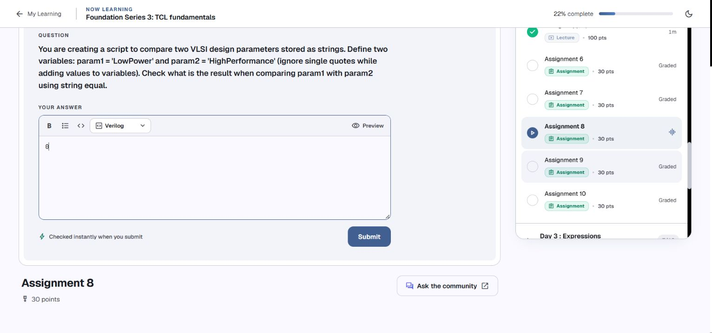

# Day 2 — Tcl strings: notes, code, and assignments

[← Back to index](README.md#day-2) · [Runnable Day 2 script](internal/scripts/day-2.tcl)

**Kapil’s practice · reviewed 4 October 2026 · Tcl 8.6.18**

Grouping, string tests, indexing, searching, matching, comparison, replacement, trimming, and case conversion are explained through your console practice. Assignments 6–10 appear under the relevant indexing, matching, or comparison lesson, beside their complete solutions.

Source: [Namaste FPGA Tcl course](https://namaste-fpga.com/student/learn/37?contentId=1801), your original console screenshots, and the [pasted console session](internal/sources/console-session.txt). The screenshots record the filled drafts at review time. No assignment was submitted by Codex; review and submission remain your step.

## Contents

- [Drafts at a glance](#drafts-at-a-glance)
- [Group words with quotes or braces](#group-words-with-quotes-or-braces)
- [Literal quotes, single quotes, and multiline strings](#literal-quotes-single-quotes-and-multiline-strings)
- [Test the contents with string is](#test-the-contents-with-string-is)
- [Count characters and read an index](#count-characters-and-read-an-index)
  - [Assignment 6: Exact special string and its length](#assignment-6-exact-special-string-and-its-length)
  - [Assignment 7: Digits equal to 3: sum their indices](#assignment-7-digits-equal-to-3-sum-their-indices)
  - [Assignment 10: ASCII value at index 3](#assignment-10-ascii-value-at-index-3)
- [Find the first or last occurrence](#find-the-first-or-last-occurrence)
- [Match a pattern](#match-a-pattern)
  - [Assignment 9: Find LUT6 with string match](#assignment-9-find-lut6-with-string-match)
- [Compare strings or test equality](#compare-strings-or-test-equality)
  - [Assignment 8: Compare parameter values with string equal](#assignment-8-compare-parameter-values-with-string-equal)
- [Map, trim, and change case](#map-trim-and-change-case)
- [What the assignments required](#what-the-assignments-required)
- [Complete practice script](#complete-practice-script)
- [References](#references)
- [References and review](#references-and-review)

## Drafts at a glance

| Assignment | Numeric draft | Review of your console work |
| --- | --- | --- |
| [6](#assignment-6-exact-special-string-and-its-length) | `41` | Corrected the input; 39 becomes 41 |
| [7](#assignment-7-digits-equal-to-3-sum-their-indices) | `13` | Completed the digit variables and index sum |
| [8](#assignment-8-compare-parameter-values-with-string-equal) | `0` | Kept 0; corrected the compared operands |
| [9](#assignment-9-find-lut6-with-string-match) | `1` | Preserved the working pattern and result 1 |
| [10](#assignment-10-ascii-value-at-index-3) | `53` | Completed character 5 to ASCII value 53 |

The course requests numeric answers, so the entered field contains the number. The complete code is rendered below each question for your study and review.

[← Back to index](README.md#day-2) · [Day contents](#contents)

## Group words with quotes or braces

Your console showed:

```text
% puts "hello world""
extra characters after close-quote
% puts hello world
can not find channel named "hello"
% puts "hello world"
hello world
% puts {hello world }
hello world
```

The extra quote in the first command is a syntax error. In the second, `hello` and `world` are separate words. With two ordinary arguments, `puts` interprets the first as a channel name, so it tries to write `world` to a channel called `hello`. Group the complete phrase into one argument:

```tcl
puts "hello world"
puts {hello world}
```

Output:

```text
hello world
hello world
```

Quotes and braces both group text; they differ in substitution. Your variable example demonstrates that difference:

```tcl
set var1 12
puts "The value of var1 is $var1"
puts {The value of var1 is $var1}
```

Output:

```text
The value of var1 is 12
The value of var1 is $var1
```

The quoted word substitutes `$var1`. The braced word preserves it literally at this parsing stage. Braces also prevent `[command]` and ordinary backslash substitutions; backslash followed by a physical newline is the exception. This is the same mechanism that makes `{mem[addr]}` safe in your Day 1 example. [Tcl grouping rules](https://www.tcl-lang.org/man/tcl8.6/TclCmd/Tcl.htm).

Your bare `puts` failed because it had no text argument. `puts` needs a string even when you only want a blank line; `puts ""` prints an empty line.

[← Back to index](README.md#day-2) · [Day contents](#contents)

## Literal quotes, single quotes, and multiline strings

You tried `puts \"How are you? \"`. Escaping the quotes makes them ordinary characters; it does not group the intervening spaces. Your successful forms supply one complete argument:

```tcl
puts "\"How are you? \""
puts {"How are you "}
```

Output, including the literal double quotes:

```text
"How are you? "
"How are you "
```

In Tcl, apostrophes are ordinary characters. They are not string delimiters. This mattered when you wrote:

```text
set var1 '3453383'
set param1 'LowPower'
set memory_block 'RAM512KB'
```

Those commands store the apostrophes too. The first value has nine characters, rather than seven. Use `3453383`, `"3453383"`, or `{3453383}` for the seven digits. For a phrase containing spaces, choose quotes or braces; apostrophes will not group it.

Your multiline APB description works because the closing double quote comes after the final line:

```tcl
set description "APB is used to
build
Slow peripherals
in SoC"
puts $description
```

Output:

```text
APB is used to
build
Slow peripherals
in SoC
```

Your original closing quote was on a new line after `in SoC`, so the stored string also ended with a newline. The extra blank line after printing was a consequence of that stored newline plus the newline added by `puts`.

The characters `~`, `@`, `%`, `^`, `+`, and `!` in Assignment 6 are ordinary text inside its braced string. Your `\@` did not change the value; escaping `@` was unnecessary. The actual assignment correction was restoring the missing space and `%`.

[← Back to index](README.md#day-2) · [Day contents](#contents)

## Test the contents with string is

Your classifier commands produced these results:

| Command | Result | What it establishes |
| --- | --- | --- |
| `string is digit 123` | `1` | All characters are digits. |
| `string is digit 123a` | `0` | `a` is not a decimal digit. |
| `string is xdigit 123a` | `1` | `a` is a hexadecimal digit. |
| `string is integer -344` | `1` | The complete value is a valid integer. |
| `string is upper ABC` | `1` | All letters satisfy the uppercase class. |
| `string is lower afC` | `0` | The uppercase `C` fails the lowercase class. |
| `string is boolean 1` | `1` | A recognised Boolean representation. |
| `string is boolean 0` | `1` | A recognised Boolean representation. |
| `string is boolean no` | `1` | A recognised false representation. |
| `string is boolean 3` | `0` | Not a recognised Boolean string. |

Here `1` means the test succeeded, and `0` means it failed. `digit` tests characters; `integer` recognises an integer representation, including a leading minus sign. For these Tcl 8.6 commands, `integer` has a bounded integer range; `entier` is the class for arbitrary-size integers.

An empty string passes these classes by default. If you require a nonempty value, add `-strict`:

```tcl
puts [string is digit ""]
puts [string is digit -strict ""]
```

Output:

```text
1
0
```

This empty-input example is an added clarification. [Official string-class definitions](https://www.tcl-lang.org/man/tcl8.6/TclCmd/string.htm).

[← Back to index](README.md#day-2) · [Day contents](#contents)

## Count characters and read an index

Your length results are consistent with spaces being part of the string:

| Input | Length |
| --- | --- |
| `hello` | `5` |
| `"Hello world "` | `12` |
| `{Hello world }` | `12` |
| `{ Hello world }` | `13` |

The grouping delimiters do not become part of the value. Leading and trailing spaces inside them do. `string length` counts characters; it is not generally a byte count.

Indices start at zero. Your name example can be checked with this trace:

| Index | `0` | `1` | `2` | `3` | `4` |
| --- | --- | --- | --- | --- | --- |
| Character in `Kapil` | `K` | `a` | `p` | `i` | `l` |

```tcl
puts [string index Kapil 4]
puts [string index Kapil end]
puts [string index Kapil end-1]
puts "outside=<[string index Kapil 5]>"
```

Output:

```text
l
l
i
outside=<>
```

`end` is the last index; `end-1` is one before it. An index outside the string returns an empty string, explaining the blank result from `string index Kapil 5` and `end+1` in your console.

Your Assignment 10 attempts illustrate three different mistakes:

| Attempt | Consequence |
| --- | --- |
| `string index 3 $memory_block` | The arguments are reversed; Tcl tries to use the stored text as an index. |
| `string index $memory_block 3` after storing `'RAM512KB'` | Returns `M`, because the leading apostrophe shifts the positions. |
| `string index memory_block 3` | Reads the literal word `memory_block`, returning its fourth character, `o`. |

After correcting the value and using `$memory_block`, index `3` returns `5`. The question asks for its ASCII number, so the completed solution converts that character to `53` with `scan ... %c`. [Indexing rules](https://www.tcl-lang.org/man/tcl8.6/TclCmd/string.htm) · [Character scanning](https://www.tcl-lang.org/man/tcl8.6/TclCmd/scan.htm).

### Assignment 6: Exact special string and its length

[Related lesson: Count characters and read an index](#count-characters-and-read-an-index)


**Problem:** Store the exact supplied text in `specialString`, protect literal content with grouping, and return its length. Ignore the quotation marks used to describe the value in the question.

**Your work:** Corrected the input; 39 becomes 41.

**Complete solution:**

```tcl
set specialString {~@%^+++!!This is special string!! +++^%@~}
puts [string length $specialString]
```

**Output and entered numeric draft:**

```text
41
```

The exact value is:

```text
~@%^+++!!This is special string!! +++^%@~
```

Your pasted command stored:

```text
~@%^+++!!This is special string!!+++^@~
```

Your `39` was the correct length of that shorter string. The question adds a space after the second `!!` and a `%` before the final `@`, adding two characters. Braces store the supplied text literally, and `string length` returns `41`. Escaping `@` did not fix the transcription difference, because `@` already behaves as ordinary text here.

[← Back to index](README.md#day-2) · [Related lesson: Count characters and read an index](#count-characters-and-read-an-index) · [Day contents](#contents)

### Assignment 7: Digits equal to 3: sum their indices

[Related lesson: Count characters and read an index](#count-characters-and-read-an-index)


**Problem:** Use the fixed seven-digit string `3453383`, put each digit in a separate variable, and manually sum the indices containing `3`. The permitted executable commands are only `set` and `puts`.

**Your work:** Completed the digit variables and index sum.

**Complete solution:**

```tcl
set digits 3453383
set digit0 3
set digit1 4
set digit2 5
set digit3 3
set digit4 3
set digit5 8
set digit6 3
# Matching indices: 0, 3, 4, 6. Their manually calculated sum is 13.
set index_sum 13
puts $index_sum
```

**Output and entered numeric draft:**

```text
13
```

Tcl string positions begin at zero:

| Index | 0 | 1 | 2 | 3 | 4 | 5 | 6 |
| --- | --- | --- | --- | --- | --- | --- | --- |
| Digit | 3 | 4 | 5 | 3 | 3 | 8 | 3 |
| Equals 3? | Yes | No | No | Yes | Yes | No | Yes |

The matching indices are `0`, `3`, `4`, and `6`; their manual sum is `13`. This sums indices, rather than the four matching digit values, whose sum would be `12`.

Your `set var1 '3453383'` included the apostrophes in the stored value. The completed solution stores the seven digits without apostrophes and assigns the seven digit variables manually for this fixed input. Every executable line uses `set` or `puts`; the addition is calculated manually, as the problem requests.

[← Back to index](README.md#day-2) · [Related lesson: Count characters and read an index](#count-characters-and-read-an-index) · [Day contents](#contents)

### Assignment 10: ASCII value at index 3

[Related lesson: Count characters and read an index](#count-characters-and-read-an-index)


**Problem:** For `RAM512KB`, read the character at zero-based index `3` and report its ASCII value using the mapping supplied in the question.

**Your work:** Completed character 5 to ASCII value 53.

**Complete solution:**

```tcl
set memory_block RAM512KB
set character [string index $memory_block 3]
set ascii_value [scan $character %c]
puts $ascii_value
```

**Output and entered numeric draft:**

```text
53
```

The character trace is:

| Index | 0 | 1 | 2 | 3 | 4 | 5 | 6 | 7 |
| --- | --- | --- | --- | --- | --- | --- | --- | --- |
| Character | R | A | M | 5 | 1 | 2 | K | B |

Your corrected `string index $memory_block 3` returned the character `5`. The requested number is its ASCII value, `53`. `scan $character %c` returns the character code; for this ASCII character, that code is `53`.

The earlier single-quoted value shifted the indices, producing `M` at index `3`. Reversing the `string index` arguments produced a bad-index error, while omitting `$` read the literal word `memory_block` and returned `o`. Your final lookup fixed those errors; the character-code conversion completes the remaining part of the question.

[← Back to index](README.md#day-2) · [Related lesson: Count characters and read an index](#count-characters-and-read-an-index) · [Day contents](#contents)

[← Back to index](README.md#day-2) · [Day contents](#contents)

## Find the first or last occurrence

Your `hello` searches returned `0` for `he`, `3` for `lo`, and `-1` for the absent `ee`. A start index limits where the search begins; it does not change the returned index into a relative offset.

```tcl
set word hello
puts [string first he $word]
puts [string first lo $word 1]
puts [string first he $word 3]
set word console
puts [string first o $word]
puts [string last o $word]
```

Output:

```text
0
3
-1
1
4
```

For `console`, the `o` characters are at indices `1` and `4`. `first` chooses the earlier occurrence and `last` the later one. An unsuccessful search returns `-1`, rather than the empty string returned by out-of-range `string index`.

[← Back to index](README.md#day-2) · [Day contents](#contents)

## Match a pattern

`string match` compares a pattern against the whole input. Your examples show why a trailing space matters, and why `-nocase` does not remove it:

```tcl
puts [string match test "test "]
puts [string match -nocase Test "test "]
puts [string match -nocase Test test]
puts [string match {*test} Notest]
puts [string match {*test*} NotestOr]
puts [string match {t?st} test]
```

Output:

```text
0
0
1
1
1
1
```

`*` matches any sequence, including no characters; `?` matches exactly one character. Therefore `?LUT6?` is a six-character pattern. It cannot match your complete resources string, which is much longer. `*LUT6*` permits any amount of text before and after `LUT6`, as Assignment 9 requests.

Your `string match ?primitives?` also lacked the input-string argument. The form is `string match pattern string`, with optional `-nocase` before the pattern. Braces around a pattern preserve its literal wildcard notation for the matcher. [Official pattern rules](https://www.tcl-lang.org/man/tcl8.6/TclCmd/string.htm).

### Assignment 9: Find LUT6 with string match

[Related lesson: Match a pattern](#match-a-pattern)


**Problem:** Store `LUT6 LUT4 FMUX DFF BUFG BRAM REG` as the resource string and use `string match` to test whether it contains `LUT6`, allowing arbitrary text before and after it.

**Your work:** Preserved the working pattern and result 1.

**Complete solution:**

```tcl
set primitives {LUT6 LUT4 FMUX DFF BUFG BRAM REG}
puts [string match {*LUT6*} $primitives]
```

**Output and entered numeric draft:**

```text
1
```

Your final `string match *LUT6* $value` returned `1` and satisfies the requested match. The clean version uses `primitives` as the resource variable; it preserves your pattern and result.

Each `*` accepts any number of characters, including zero. Your earlier `?LUT6?` permits exactly one character on either side, so it cannot match this whole resources string. `string match ?primitives?` was missing the input-string argument. The course asks for this substring pattern test, so the complete resources string is tested against `*LUT6*`.

[← Back to index](README.md#day-2) · [Related lesson: Match a pattern](#match-a-pattern) · [Day contents](#contents)

[← Back to index](README.md#day-2) · [Day contents](#contents)

## Compare strings or test equality

`string compare` returns an ordering result: `-1`, `0`, or `1`. `string equal` returns a truth result: `0` or `1`. For your ASCII-letter examples, character-code order explains why uppercase and lowercase can compare differently:

```tcl
puts [string compare a b]
puts [string compare b a]
puts [string compare abc Abc]
puts [string compare -nocase abc Abc]
puts [string equal Hello hello]
puts [string equal -nocase Hello hello]
puts [string equal -nocase -length 5 Hellogg hellodd]
```

Output:

```text
-1
1
1
0
0
1
1
```

The final command checks only the first five characters, ignoring case. It does not establish that the whole strings are equal.

For Assignment 8, `string equal param1 param2` compared the names as literal text. Its `0` happened to agree with the desired answer, because the stored strings are different too. Correct the operands even when the numeric result looks right:

```tcl
set param1 LowPower
set param2 HighPerformance
puts [string equal $param1 $param2]
puts [string compare $param1 $param2]
```

Output:

```text
0
1
```

The assignment asks for `equal`, so its draft is `0`. The `compare` line is included here to explain the distinction; its `1` is not the requested answer.

### Assignment 8: Compare parameter values with string equal

[Related lesson: Compare strings or test equality](#compare-strings-or-test-equality)



**Problem:** Set `param1` to `LowPower` and `param2` to `HighPerformance`, without the descriptive apostrophes, then return the result of `string equal`.

**Your work:** Kept 0; corrected the compared operands.

**Complete solution:**

```tcl
set param1 LowPower
set param2 HighPerformance
puts [string equal $param1 $param2]
```

**Output and entered numeric draft:**

```text
0
```

Your `string equal param1 param2` returned `0`, but it compared the literal names. The desired test reads the stored values using `$param1` and `$param2`. Those values are different too, so the correct answer is still `0`.

Your single-quoted declarations also stored literal apostrophes. The clean declarations above use the exact values requested. `string compare $param1 $param2` would return `1` for their ordering; the question asks for `string equal`, whose result is `0`. A matching final number does not by itself prove that the intended operands were used.

[← Back to index](README.md#day-2) · [Related lesson: Compare strings or test equality](#compare-strings-or-test-equality) · [Day contents](#contents)

[← Back to index](README.md#day-2) · [Day contents](#contents)

## Map, trim, and change case

You correctly observed that mapping returned changed text while `puts $var1` still printed `hello`. String transformations return a new value; store that result if you want to update the variable.

```tcl
set var1 hello
puts [string map {h 1} $var1]
puts $var1
set var1 [string map {hello world} $var1]
puts $var1
set var2 {Hello~World~!}
puts [string map {~ { } ! .} $var2]
```

Output:

```text
1ello
hello
world
Hello World .
```

The mapping alternates old and new substrings. `{ }` supplies a single space as the replacement for `~`. That space before the final `.` comes from the last `~` in the original value.

Your `$puts var1` failed before a command could run: `$puts` tried to read a variable named `puts`. Keep `puts` as the command word and substitute the variable you want to print: `puts $var1`.

The following delimiters make leading and trailing spaces visible:

```tcl
set text "  Hello world  "
puts "trim=<[string trim $text]>"
puts "left=<[string trimleft $text]>"
puts "right=<[string trimright $text]>"
puts "lower=<[string tolower $text]>"
puts "upper=<[string toupper $text]>"
puts [string toupper 12hello]
```

Output:

```text
trim=<Hello world>
left=<Hello world  >
right=<  Hello world>
lower=<  hello world  >
upper=<  HELLO WORLD  >
12HELLO
```

Trimming removes whitespace at the selected ends, while case conversion preserves spaces and digits. These calls leave `text` unchanged. Use `set text [string trim $text]` to retain a transformed result. [Official string transformations](https://www.tcl-lang.org/man/tcl8.6/TclCmd/string.htm).

[← Back to index](README.md#day-2) · [Day contents](#contents)

## What the assignments required

| Assignment | Your work | Completed draft |
| --- | --- | --- |
| 6 | Stored a shorter special string; its length `39` was correct for that shorter input. | Restore the question’s space and `%`; length `41`. |
| 7 | Stored `'3453383'`; the digit variables and index sum were absent. | Seven digits, matching indices `0, 3, 4, 6`, sum `13`; only `set` and `puts`. |
| 8 | Equality result `0`, but compared literal names. | Read `$param1` and `$param2`; equality result `0`. |
| 9 | Your final `*LUT6*` match returned `1`. | Preserve that match and result. |
| 10 | Your final index lookup returned the character `5`. | Convert it to the requested ASCII value `53`. |

The question screenshots, full solutions, and reasoning appear under their lessons on this page. Use the [day contents](#contents) to jump to a question. Numeric drafts were entered in separate Chrome tabs at review time; review and submission remain your step.

[← Back to index](README.md#day-2) · [Day contents](#contents)

## Complete practice script

[Open the runnable Day 2 script](internal/scripts/day-2.tcl).

Save this block as `internal/scripts/day-2.tcl` in the Tcl workspace and run `source internal/scripts/day-2.tcl` from your Tcl console. It demonstrates the commands from your session and gives visible boundaries around whitespace.

```tcl
set var1 12
puts "substitution=$var1"
puts {literal=$var1}
puts [string is digit 123a]
puts [string is xdigit 123a]
puts [string length "Hello world "]
puts [string index Kapil end-1]
puts [string first lo hello]
puts [string last o console]
puts [string match {*LUT6*} {LUT6 LUT4 FMUX DFF BUFG BRAM REG}]
puts [string compare -nocase abc Abc]
puts [string equal -nocase Hello hello]
set mapped [string map {~ { } ! .} {Hello~World~!}]
puts $mapped
set text "  Hello world  "
puts "trim=<[string trim $text]>"
puts "upper=<[string toupper $text]>"
set specialString {~@%^+++!!This is special string!! +++^%@~}
puts [string length $specialString]
set memory_block RAM512KB
set character [string index $memory_block 3]
puts [scan $character %c]
```

Expected output:

```text
substitution=12
literal=$var1
0
1
12
i
3
4
1
0
1
Hello World .
trim=<Hello world>
upper=<  HELLO WORLD  >
41
53
```

[← Back to index](README.md#day-2) · [Day contents](#contents)

## References

- [Tcl language syntax](https://www.tcl-lang.org/man/tcl8.6/TclCmd/Tcl.htm) — grouping and substitution.
- [string](https://www.tcl-lang.org/man/tcl8.6/TclCmd/string.htm) — the subcommands used in this session.
- [puts](https://www.tcl-lang.org/man/tcl8.6/TclCmd/puts.htm) and [scan](https://www.tcl-lang.org/man/tcl8.6/TclCmd/scan.htm) — output and character-code conversion.

[← Back to index](README.md#day-2) · [Day contents](#contents)

## References and review

The original questions and numeric-answer format come from the course linked above. Command behavior was checked against the official Tcl 8.6 manuals for [string](https://www.tcl-lang.org/man/tcl8.6/TclCmd/string.htm) and [scan](https://www.tcl-lang.org/man/tcl8.6/TclCmd/scan.htm).

The screenshots record the filled, unsubmitted drafts at review time. Review the values and code before using the course’s Submit button yourself.

[← Back to index](README.md#day-2) · [Day contents](#contents)
