# Assignment ideas — Days 4 to 6

[← Back to the main index](README.md) · [Day 4 notes](day-4.md) · [Day 5 notes](day-5.md) · [Day 6 notes](day-6.md)

These are approaches for **Assignments 17–33**, based on the actual Namaste FPGA questions checked on 5 October 2026. Each section explains how to choose a representation, plan the calculation, and check your implementation. Final numerical answers and completed assignment programs are left for you to produce. The original question is shown before its discussion; the course answer boxes were left untouched.

Your early Q17, Q18, and Q23 experiments are connected to their relevant explanations. The earlier completed reviews for Assignments 1–16 remain on the Day 1–3 pages.

## Index

| Day | Assignment and topic | Main idea |
| --- | --- | --- |
| [4](#day-4) | [17 · Unique capacitance values](#assignment-17-unique-capacitance-values) | Remove duplicates, then count |
| [4](#day-4) | [18 · Second position after reversal](#assignment-18-second-position-after-reversing-a-list) | Reverse the sequence; translate a position to an index |
| [4](#day-4) | [19 · Widths above a limit](#assignment-19-sum-widths-above-a-strict-limit) | Test every occurrence and accumulate selected widths |
| [4](#day-4) | [20 · Power under a running limit](#assignment-20-accumulate-power-under-a-running-limit) | Test the proposed new total before accepting a value |
| [4](#day-4) | [21 · Non-faulty transistor count](#assignment-21-count-non-faulty-transistors-with-in) | Turn membership into a contribution without an `if` |
| [4](#day-4) | [22 · Numeric name suffixes](#assignment-22-count-net-names-with-numeric-suffixes) | Match an ending pattern and count Boolean matches |
| [5](#day-5) | [23 · Transistor W/L ratios](#assignment-23-transistor-width-to-length-ratios) | Preserve each transistor’s fields, filter ratios, then round |
| [5](#day-5) | [24 · Maximum leakage cell](#assignment-24-cell-with-the-highest-leakage-current) | Track the largest value together with its key |
| [5](#day-5) | [25 · Parallel PMOS resistance](#assignment-25-parallel-pmos-resistance) | Sum conductances of selected branches, then invert |
| [5](#day-5) | [26 · Interconnects above average](#assignment-26-indexed-interconnects-and-an-average-filter) | Build an indexed array; determine the average before filtering |
| [5](#day-5) | [27 · Maximum gate power](#assignment-27-largest-gate-power-from-a-value-list) | Extract values without their keys and compare numerically |
| [6](#day-6) | [28 · Safe voltage nodes](#assignment-28-count-nodes-in-an-inclusive-voltage-range) | Combine both inclusive bounds |
| [6](#day-6) | [29 · Resistance bands](#assignment-29-transform-and-sum-resistance-values) | Select exactly one transformation for each entry |
| [6](#day-6) | [30 · Reverse an integer](#assignment-30-reverse-a-number-one-digit-at-a-time) | Remove a last digit and append it to a new integer |
| [6](#day-6) | [31 · Count digits](#assignment-31-count-digits-with-while) | Count integer-division steps |
| [6](#day-6) | [32 · Sampling-rate multipliers](#assignment-32-switch-selected-sampling-rate-multipliers) | Select a factor with `switch`; update a product |
| [6](#day-6) | [33 · Factorial](#assignment-33-factorial-with-a-loop) | Multiply successive factors with an inclusive final bound |

## How to use the ideas

Read the question and identify four things before coding: the input representation, the condition that selects or changes an entry, what the accumulator means, and the requested output type. Write those in comments at the top of your own script. Then implement one stage at a time: inspect the stored input, check a single iteration, and finally check the whole traversal.

Use small, different practice inputs when checking the mechanism. Keep temporary tracing output while you debug, then distinguish it from the single result requested by the course. Reset your variables before each run so an earlier console session cannot supply a missing initialization. The runnable Day 5 and Day 6 scripts demonstrate the language mechanisms on lesson data; they do not contain these assignment solutions.

## Day 4

Lists, iteration, and regular expressions · [Day 4 notes](day-4.md) · [Main Day 4 index](README.md#day-4)

### Assignment 17: Unique capacitance values

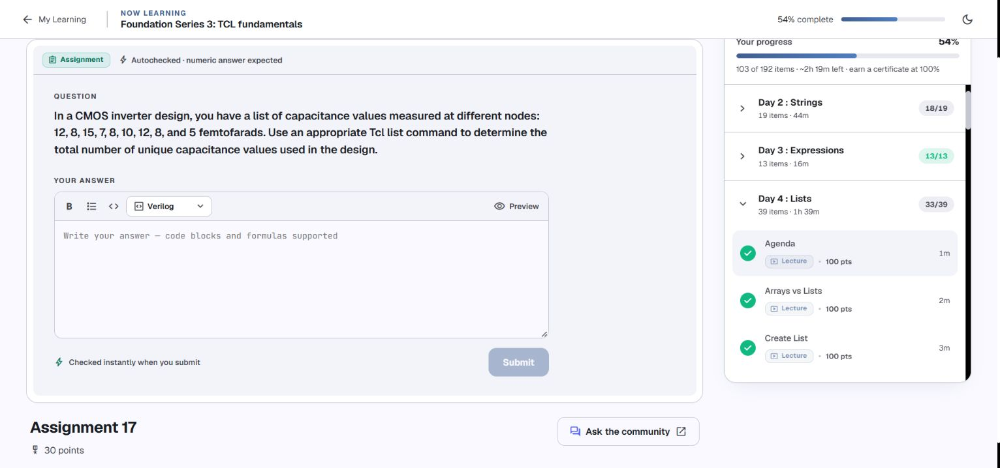

**What you need to produce:** the number of distinct capacitance values, rather than the number of measurements. Use the full input from the question, including the `10` that was absent from one of your preliminary lists.

**Approach.** First store every measurement in a valid Tcl list. Repeated measurements are separate elements at this stage. Next obtain a list with one representative of each distinct value; investigate the `-unique` option of `lsort`. These are numeric measurements, so choose a numeric comparison mode appropriate to the given integer values. Finally apply `llength` to the returned distinct-value list. Keep these stages separate while debugging, rather than immediately nesting them into one expression.

Sorting alone orders the data but does not remove duplicates. Counting the original list counts repetitions too. Also, `lsort` returns a new list; it does not rewrite the original variable unless you store that return value. The key distinction is between **a measurement occurrence** and **a value that occurs at least once**.

**Check your reasoning.** Adding another copy of an existing value should not increase the unique count. Adding a genuinely new value should increase it once. On a separate test list with all entries equal, the distinct-value list should contain one element. Reordering the original measurements should not change the result. These checks exercise uniqueness without revealing the assignment answer.

**Connection to your work:** your preliminary `llength` counted all stored elements, and an omitted input prevented a faithful calculation. [Review that attempt](day-4.md#assignment-17-preliminary-capacitance-list-practice) and the [sorting lesson](day-4.md#sort-text-integers-and-real-numbers).

[← Back to ideas index](#index) · [← Main index](README.md#day-4)

### Assignment 18: Second position after reversing a list

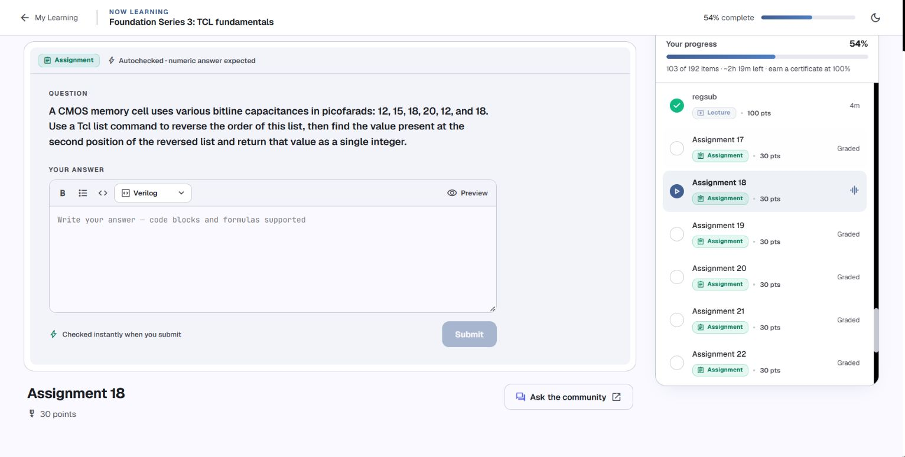

**What you need to produce:** the value in the second position of the reversed capacitance sequence, returned as an integer. Reversal concerns the original order, including repeated values.

**Approach.** Preserve the question’s input sequence exactly and obtain its reversal with `lreverse`. Store that returned list so you can inspect it. Then use `lindex` to select the requested position. Translate ordinary position numbering into Tcl’s zero-based indexing before writing that lookup: the first position has index `0`, so think carefully about the second position.

`lreverse` does not sort the capacitances. A decreasing numeric sort might look plausible, but it answers a different question. Do not remove duplicates here: the task asks about a position in the reversed sequence, and duplicate entries occupy positions. The input and its reversal should have the same number of elements.

**Check your reasoning.** Reversing twice should recover the original sequence. The reversed list’s first element should equal the original list’s last element. More generally, for a list of length $n$, reversed index $k$ corresponds to original index $n-1-k$. Use that relationship to check your position lookup independently, without printing a completed answer here.

**Connection to your work:** the earlier Day 4 session contains `cap_list1` and reversal practice using this question’s sequence. Preserve that useful attempt, then verify that your final lookup selects the requested position. See [list indexing](day-4.md#read-nested-indices-with-lindex) and [the original Day 4 continuation](internal/sources/console-session-2026-10-04-regexp-regsub.txt).

[← Back to ideas index](#index) · [← Main index](README.md#day-4)

### Assignment 19: Sum widths above a strict limit

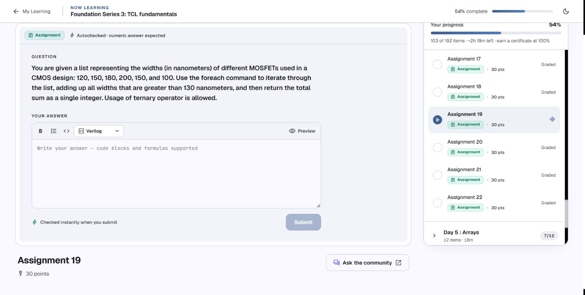

**What you need to produce:** the sum of every width greater than `130` nanometers, using `foreach`. The prompt permits a ternary expression.

**Approach.** Initialize a running sum before the loop. Let `foreach` bind one width on each iteration. That width contributes its full value when the strict comparison succeeds; otherwise it contributes zero. Use `expr` for the comparison and arithmetic. A ternary expression can choose between the width and zero, allowing the same accumulator update on every iteration.

The accumulator should represent the sum of qualifying widths seen **so far**. After a rejected entry it stays unchanged. After an accepted entry it increases by that width. This is a sum, so counting accepted entries would be insufficient. It is also a list of transistor measurements, so repeated width values remain separate contributions: two transistors can have equal widths.

**Check your reasoning.** Try a different small list containing one value below the limit, one exactly equal to it, and one above it. Equality must be rejected because the wording is “greater than.” Verify that an all-rejected test leaves the sum at zero, and that accepting the same width twice adds it twice. Avoid `lsort -unique`, which would remove real occurrences from this task.

**Related lesson:** [foreach traversal](day-4.md#iterate-over-lists-with-foreach), [expressions and arithmetic](day-3.md#use-expr-for-arithmetic).

[← Back to ideas index](#index) · [← Main index](README.md#day-4)

### Assignment 20: Accumulate power under a running limit

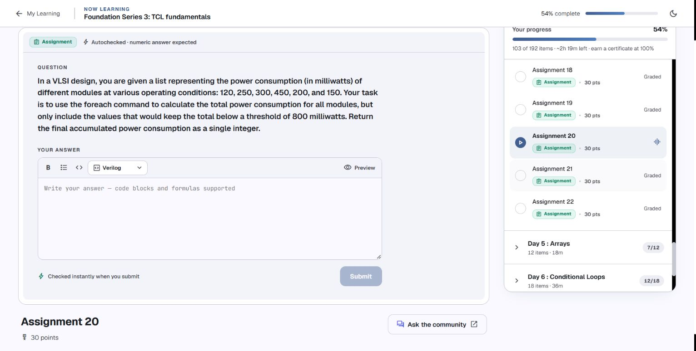

**What you need to produce:** the final accumulated power after visiting the list in its given order and accepting only additions that keep the total **below** `800` milliwatts.

**Approach.** Start with an empty total. On each `foreach` iteration, form a candidate total from the accepted total so far plus the current module’s power. Compare the candidate with the threshold **before** storing it. If the candidate is permitted, accept it as the new total. Otherwise retain the old total and continue to the next entry.

The condition concerns the proposed **combined total**, not whether the current module alone is below the limit. Testing the old total is also insufficient: an old total can be safe while the next addition is too large. Because the wording says “below,” an addition landing exactly on the threshold is rejected.

**Ordering matters.** This approach follows the stated sequential accumulation. It does not search for the globally best combination of modules. Sorting the powers changes which values can be accepted, so preserve the question’s original sequence. Rejecting one module does not imply that every later module is too large; a later smaller addition might fit. Do not end the traversal merely because one candidate is rejected.

**Check your reasoning.** Make a trace with columns for current power, total before the addition, candidate total, acceptance, and total after the decision. For separate practice data, include a rejected large addition followed by a small addition that fits. Every stored total should stay below the threshold, and every rejected step should leave it unchanged.

**Related lesson:** [foreach](day-4.md#iterate-over-lists-with-foreach), [accumulators and boundaries](day-6.md#choose-an-accumulator-and-verify-loop-boundaries).

[← Back to ideas index](#index) · [← Main index](README.md#day-4)

### Assignment 21: Count non-faulty transistors with in

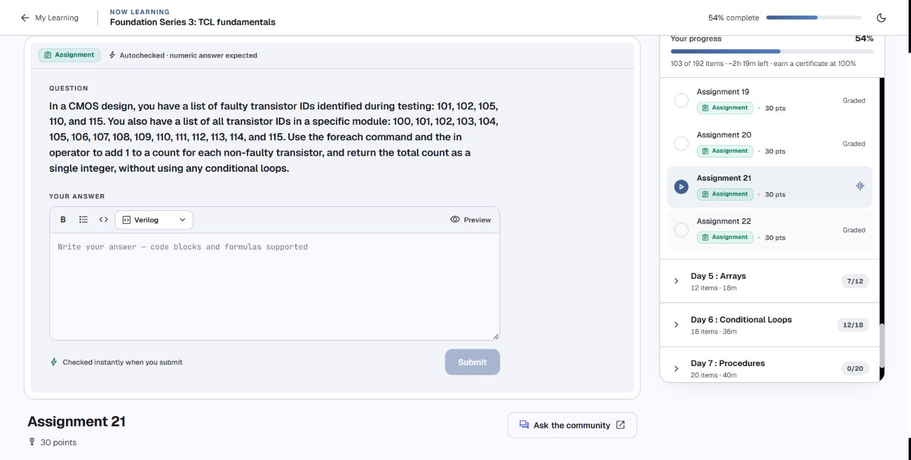

**What you need to produce:** a count of IDs from the all-transistor list that are absent from the faulty list. The question specifically asks for `foreach` and `in`, without conditional loops.

**Approach.** Traverse the all-transistor list. For each current ID, evaluate its membership in the faulty list with the expression operator `in`. That yields a Boolean numeric result: membership is true for a faulty transistor. Turn that result into its complementary contribution, so a non-faulty transistor adds one and a faulty transistor adds zero. Accumulate those contributions starting from zero. This allows the same update on every iteration, without adding an `if`/`else` branch.

If the faulty-membership result is $m_i$, the non-faulty contribution is $1-m_i$. The important reasoning step is that the task counts the **opposite** of faulty membership. Adding the unmodified membership result would count faulty transistors instead. Although `ni` expresses absence directly, this exercise explicitly names `in`, so use the requested operator when you implement the complement.

**Check your reasoning.** On different practice data, consider three cases: an empty faulty list, a faulty list containing every module ID, and faulty IDs that do not occur in the module at all. The last case should not reduce the module’s good count. Membership compares a whole list element; it does not treat ID `10` as matching ID `100` merely because their text shares a prefix.

The count is by entries visited in the all-transistor list. If a future problem permits repeated IDs and asks for unique devices, that would require an additional uniqueness rule; do not invent that rule here.

**Related lesson:** [in and ni](day-4.md#test-membership-and-save-the-result), [foreach](day-4.md#iterate-over-lists-with-foreach).

[← Back to ideas index](#index) · [← Main index](README.md#day-4)

### Assignment 22: Count net names with numeric suffixes

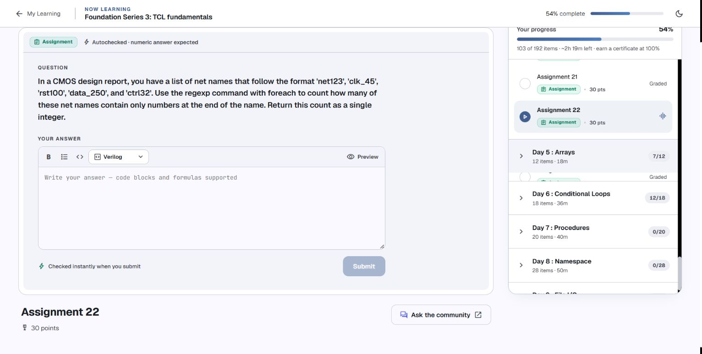

**What you need to produce:** a count of net names with a numeric ending, using `regexp` inside `foreach`. The question is about the ending of the name; it does not require the entire name to consist of digits.

**Approach.** Design the suffix test first. Think about a decimal-digit character class, a quantifier requiring at least one digit, and an anchor that places that digit sequence at the end of the input. The earlier letters and an optional underscore should not prevent the suffix from matching. Then visit each whole name with `foreach`, apply your suffix test once, and add the yes/no match result to the count.

Read the roles of `[0-9]`, `+`, and the end anchor `$` before assembling your pattern. Braces around a Tcl regex pattern preserve its special characters for the regex engine. With a simple `regexp` call, the return value reports whether a match exists. `-all` would instead count matches inside one input; here the aim is to count matching **names**, with each name contributing at most one.

**Check your interpretation.** On independent test names, a name ending in a digit sequence should qualify; a name with digits followed by letters should not. A trailing underscore or space should prevent an end-anchored digit suffix. A name containing no digits should fail. These cases distinguish a suffix test from a pattern that merely finds digits somewhere. Do not require an underscore unless the prompt requires one.

**Related lesson:** [regexp result forms](day-4.md#choose-the-result-form-of-regexp), [quantifiers and anchors](day-4.md#trace-regular-expression-patterns).

[← Back to ideas index](#index) · [← Main index](README.md#day-4)

## Day 5

Arrays and structured values · [Day 5 notes](day-5.md) · [Main Day 5 index](README.md#day-5)

### Assignment 23: Transistor width-to-length ratios

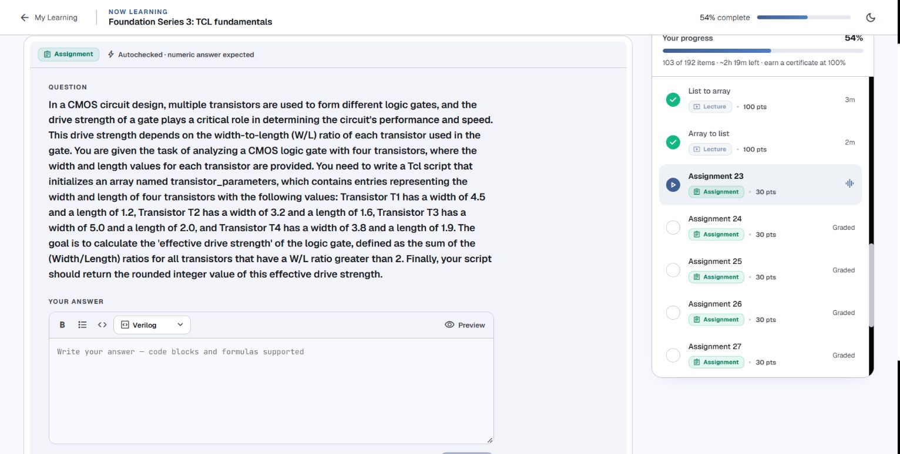

**What you need to produce:** initialize the required array `transistor_parameters`, retain each transistor’s width and length, add only W/L ratios strictly greater than `2`, and round the final sum to an integer.

**Choose the representation first.** Each transistor has an identity and two related fields. A clear representation uses the transistor ID as an array key and a two-element list containing its width and length as the value. A composite-key representation is also possible, but it requires consistent field naming. Whichever you choose, ensure that every transistor retains both fields and can be processed once.

Using widths as keys makes the mapping depend on widths being unique. If two transistors share a width, the later entry overwrites the earlier one; the device identity is lost. The question’s required array name and transistor entries are a reason to make identity explicit even when a particular data set happens to have different widths.

**Plan the calculation.** Retrieve the paired fields for one transistor, calculate its ratio with floating-point division, apply the strict ratio test, and add the qualifying ratio to a real-valued accumulator. Repeat for every transistor. Round the **combined** sum at the end; do not round each ratio before testing or adding it. Equality with the limit is excluded.

For each transistor $i$, let $q_i=W_i/L_i$. The contribution is the ratio itself when it qualifies, not its width, its length, or a count of one. W/L is dimensionless when width and length use the same units. If you later test with integer-only dimensions, preserve real division: Tcl integer division can truncate a ratio before the threshold comparison.

**Connection to your attempt.** `set array ratios {...}` supplies the wrong argument structure to `set`. Your corrected `array set ratios {...}` creates a width-to-length mapping, but it still needs the required identity representation and array name. `set {w l } ...` writes one variable named `w l `; it does not extract separate width and length lists. Use the [structured-value lesson](day-5.md#store-a-structured-value-under-an-identity-key) to see how a pair can be retrieved without losing its identity.

**Check before finishing.** Confirm one complete record per transistor. Test a separate ratio below the limit, exactly equal to it, and above it. Check that the selected contributions are ratios and that your final rounding happens once. The remaining calculation and answer are yours.

[← Back to ideas index](#index) · [← Main index](README.md#day-5)

### Assignment 24: Cell with the highest leakage current

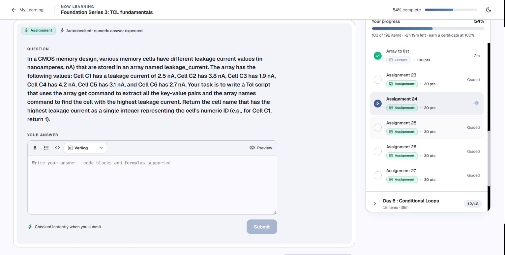

**What you need to produce:** use the required `leakage_current` array, find the cell with the greatest current, and return the numeric part of that cell’s ID. The output is an ID, not the winning current value.

**Approach.** Store each cell ID as a key and its current as the value. Use `array get` to inspect or process the key-value pairs, and use `array names` to obtain the set of available cell keys, as the prompt requests. When comparing a candidate current with the best current so far, retain **both** the larger current and its associated key. Losing the key would make it impossible to report which cell won.

Initialize the comparison from an actual entry rather than from an arbitrary assumed minimum. Then visit the remaining keys, look up each value through its key, and update the winning pair when a larger current is found. Numeric comparison belongs in an expression; sorting cell names would order identities, not leakage currents.

After the search, extract the numeric ID from the winning cell label. Consider a string operation that removes the known `C` prefix, or a regular-expression capture that separates the prefix from the digits. Leave that extraction until after selecting the winning key. The label and its current must stay associated throughout the search.

**Check your reasoning.** Verify that the winning key exists in the original array and that no other stored current is greater. `array get` order is undefined, so the outcome should not depend on its first or last printed pair. The supplied data has a highest value; for future equal maxima, decide and document a tie policy rather than relying on hash-table order. Keep units as nanoamperes for comparison; a common unit conversion would not change which entry is largest.

**Related lesson:** [keys and pairs](day-5.md#enumerate-keys-and-preserve-key-value-pairs), [aligned key and value lists](day-5.md#convert-an-array-into-aligned-key-and-value-lists).

[← Back to ideas index](#index) · [← Main index](README.md#day-5)

### Assignment 25: Parallel PMOS resistance

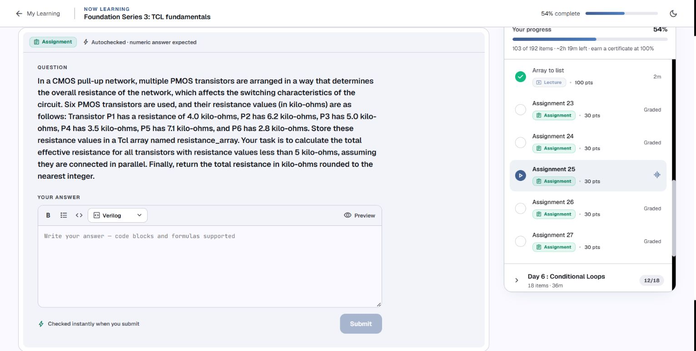

**What you need to produce:** store the resistances in `resistance_array`, select values strictly below `5` kilo-ohms, calculate their equivalent parallel resistance, and round that resistance in kilo-ohms.

**Reason about the circuit before coding.** Parallel branches share the same voltage. Each selected branch carries current $V/R_i$, and their currents add. Therefore it is **conductance**, the reciprocal of resistance, that adds:

$$
G_{\mathrm{total}}=\sum_{i\in S}\frac{1}{R_i},\qquad R_{\mathrm{eq}}=\frac{1}{G_{\mathrm{total}}},
$$

where $S$ contains exactly the branches that pass the resistance test. Adding selected resistances directly would calculate a series combination.

**Approach.** Create one array entry per PMOS identity. Initialize a real-valued conductance sum, then visit each resistance. Only a qualifying value contributes its reciprocal. After the traversal, invert the total conductance to obtain resistance. Round this final resistance once. Use floating-point division for reciprocals: integer division would discard many contributions.

Keeping every input in kilo-ohms makes the reciprocal sum use inverse kilo-ohms, and its reciprocal returns kilo-ohms. There is no need to convert to ohms unless you also convert the result back consistently. Do not include a resistance equal to the threshold, and do not accidentally treat the unselected branches as part of the parallel network.

**Check your reasoning.** On separate data with one selected branch, the equivalent resistance should equal that branch. Two equal selected branches should halve that branch resistance. For multiple positive selected branches, the unrounded equivalent should be below each branch resistance. If no branches are selected in a future test, the conductance sum is zero and must be handled before attempting its reciprocal. These checks help catch a mistaken series sum or integer division.

**Related lesson:** [array enumeration](day-5.md#enumerate-keys-and-preserve-key-value-pairs), [floating-point division](day-3.md#integer-division-and-floating-point-division).

[← Back to ideas index](#index) · [← Main index](README.md#day-5)

### Assignment 26: Indexed interconnects and an average filter

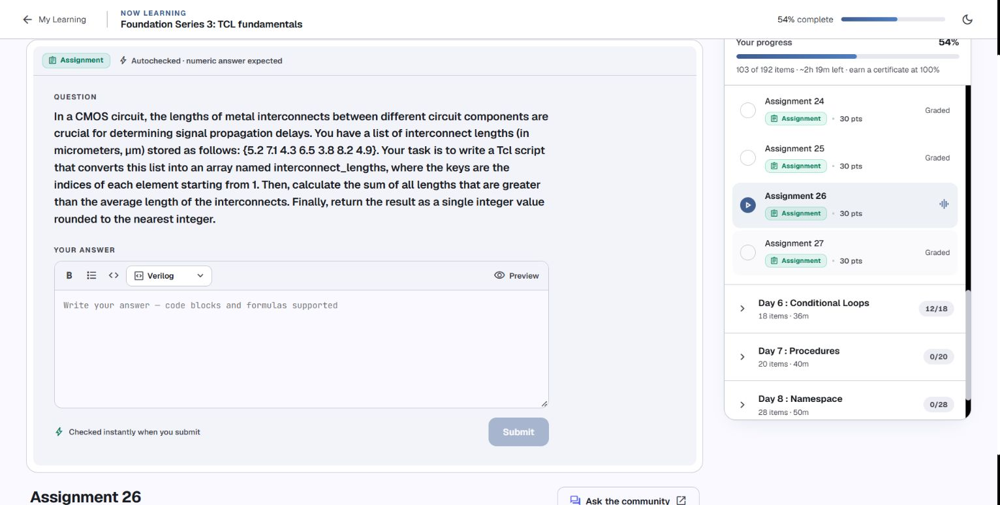

**What you need to produce:** convert the input list into `interconnect_lengths` with keys beginning at `1`, determine the average of all lengths, sum only lengths strictly above that average, and round the final selected sum.

**Approach in stages.** Start an index counter at the required first key. For each list item, store the length under the current key and advance that counter. Inspect the resulting array before calculating: every input item needs one corresponding entry, with no skipped or repeated generated key. This indexing is a deliberate mapping rule; Tcl does not generate consecutive numeric array keys automatically.

Next compute the total length and number of entries using **all** interconnects. Preserve real division when calculating the average:

$$
\bar{L}=\frac{\sum_{i=1}^{n}L_i}{n}.
$$

Only after the average is known should you make the selection pass. On that pass, compare each length against the unchanged average and accumulate the qualifying lengths. Finally round the selected sum once. The returned result is the selected **sum**, not the average and not the number of selected interconnects.

The two calculation passes have different purposes. Filtering before calculating the average changes the reference population. Comparing against a running average changes the threshold during traversal. Both would implement a different task. Array enumeration order can vary, but each pass should process every entry exactly once; there is no dependence on that order for this defined sum and average.

**Check your reasoning.** Array size should match list length, and keys should start at `1`. On a separate all-equal test list, no value is strictly above its average. On a nonempty positive test list, the average must lie between the smallest and largest lengths. Use the unrounded average for selection; premature rounding can move a value across the strict boundary.

**Related lesson:** [list-to-array conversion](day-5.md#convert-parallel-lists-into-an-array), [accumulators](day-6.md#choose-an-accumulator-and-verify-loop-boundaries).

[← Back to ideas index](#index) · [← Main index](README.md#day-5)

### Assignment 27: Largest gate power from a value list

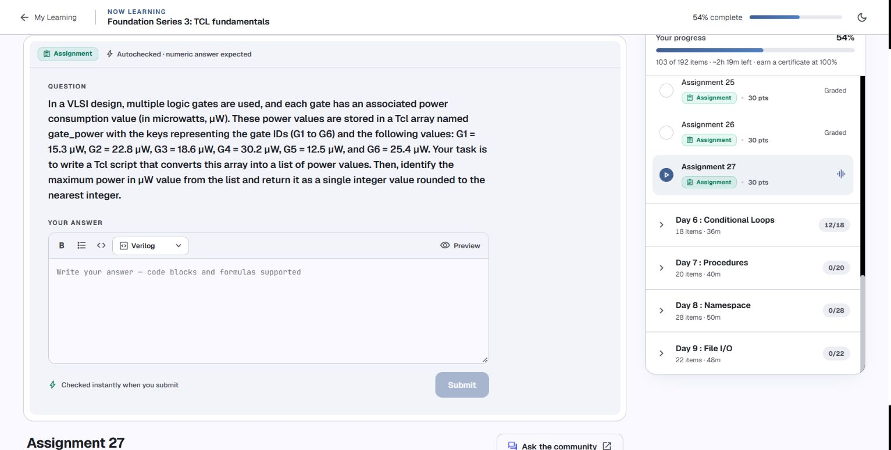

**What you need to produce:** convert the required `gate_power` array into a list containing only power values, find the greatest value, and return that power rounded to an integer. Unlike Q24, the requested output is the physical value, not a gate ID.

**Approach.** Visit the array’s entries while keeping key-value pairs intact. Append only the value from each pair to a fresh list. Alternatively, traverse `array names` and append each looked-up value. Inspect the list to ensure that it contains one real power measurement per gate and no `G...` keys.

Then find the maximum in that value list. One option is a traversal that retains the greatest value seen so far; another is a real-number sort followed by an endpoint lookup. Choose a numeric comparison mode for decimal values. Default string order is not a reliable numeric maximum, and integer sorting is unsuitable for these decimal inputs.

The power list’s order need not match array insertion order because maximum selection depends on its contents. Its length must still match the number of array entries. Complete the conversion before the maximum stage, so the implementation visibly satisfies the question’s array-to-list requirement.

**Check your reasoning.** Before rounding, the retained maximum must be a member of the extracted value list and no other value may be larger. Compare real values first, then round the selected maximum. An empty value list in a future test needs an explicit policy rather than a lookup of a nonexistent endpoint. The result stays in microwatts; do not return an index or confuse microwatts with milliwatts.

**Related lesson:** [array-to-value lists](day-5.md#convert-an-array-into-aligned-key-and-value-lists), [real-number sorting](day-4.md#sort-text-integers-and-real-numbers).

[← Back to ideas index](#index) · [← Main index](README.md#day-5)

## Day 6

Conditionals and loops · [Day 6 notes](day-6.md) · [Main Day 6 index](README.md#day-6)

### Assignment 28: Count nodes in an inclusive voltage range

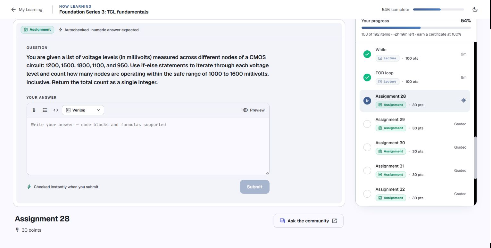

**What you need to produce:** the count of nodes whose voltages lie from `1000` through `1600` millivolts, including both endpoints, using `if`/`else` logic during traversal.

**Approach.** Use a loop to visit the measurements; `if` itself does not iterate. Start a count at zero. For each voltage, combine the lower-bound and upper-bound comparisons with logical AND. If both tests succeed, add one to the count. In the other branch, leave the count unchanged. Every voltage should contribute either one or zero, irrespective of its magnitude.

The lower bound is inclusive and so is the upper bound. Using strict greater-than or less-than would exclude an endpoint. Using OR between the two comparisons would accept many out-of-range values: a low value can still be below the upper limit, while a high value can still exceed the lower limit. Both conditions must hold simultaneously.

**Check your reasoning.** Test each endpoint on separate practice data, then values just outside the range. Each endpoint should qualify, and the values immediately outside should not. Verify that the count remains between zero and the number of measurements. Do not sum the voltages; the assignment asks for a number of nodes. Keep all values in millivolts during comparison, or convert both inputs and bounds consistently.

**Tcl detail:** brace the condition and put a space before the body, as in your corrected voting example. Keep `} else {` within the same command. See [if, elseif, and else](day-6.md#if-elseif-and-else) and [argument spacing](day-6.md#separate-the-condition-from-the-script-body).

[← Back to ideas index](#index) · [← Main index](README.md#day-6)

### Assignment 29: Transform and sum resistance values

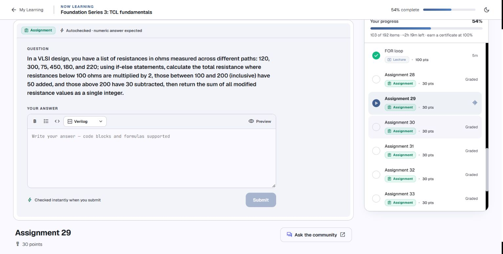

**What you need to produce:** transform each original resistance using its specified band, then sum all transformed values. This is not a filter: every entry contributes after exactly one transformation.

**Approach.** Visit the original list with a loop and use one `if`/`elseif`/`else` chain. Identify the band from the original resistance. Compute a separate modified value for the selected branch, then add that modified value to the total after the chain. Keeping selection, transformation, and accumulation distinct makes it easier to inspect an iteration.

The requested transformation can be written as a piecewise rule:

$$
f(R)=
\begin{cases}
2R, & R<100,\\
R+50, & 100\le R\le 200,\\
R-30, & R>200.
\end{cases}
$$

This restates the branch requirements without evaluating the assignment data. The middle band includes both endpoints. When using an ordered chain, the failure of the first test can already establish the middle band’s lower bound; still make the upper comparison correct.

**Avoid repeated modification.** Several separate `if` statements that test an already-modified value can apply multiple transformations. A value changed by one branch may accidentally enter another branch’s range. An exclusive chain selects once, using the original value, before the sum is updated.

**Check your reasoning.** Try different values just below, exactly on, and just above each boundary. Record original resistance, selected band, modified resistance, and running total. Every row should select one band and contribute once. Reset the sum before rerunning, and use `expr` for the arithmetic rather than writing an assignment with `=` outside an expression.

**Related lesson:** [if chains](day-6.md#if-elseif-and-else), [sum initialization](day-6.md#choose-an-accumulator-and-verify-loop-boundaries).

[← Back to ideas index](#index) · [← Main index](README.md#day-6)

### Assignment 30: Reverse a number one digit at a time

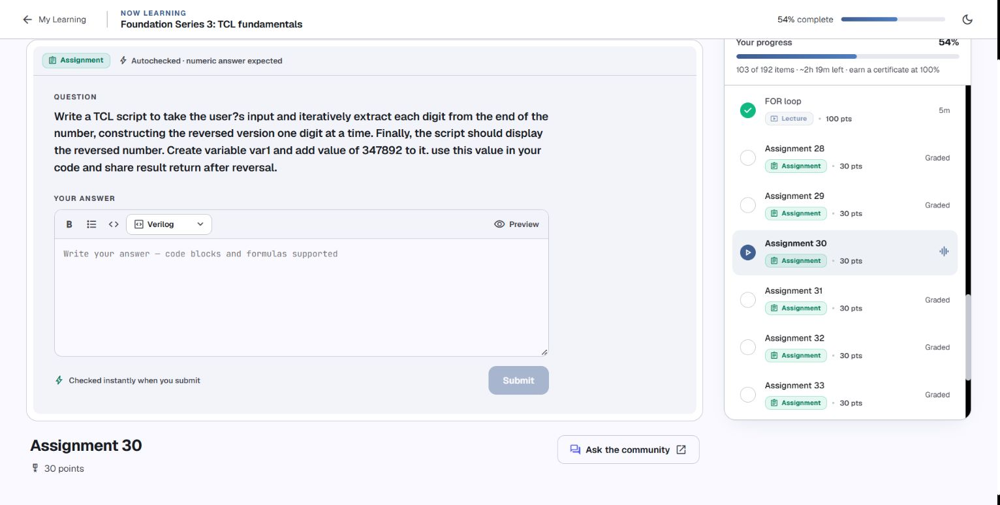

**What you need to produce:** assign the supplied number to `var1`, repeatedly extract its last digit, and construct the reversed integer one digit at a time. Implement that process rather than substituting a string-reversal shortcut.

**Approach.** Preserve the input and create a working integer plus a reversed-result accumulator. The result starts at zero. During each iteration, use remainder by ten to obtain the last digit, append that digit to the growing result by shifting its existing digits one decimal place, and remove the last digit from the working integer using integer division by ten. Repeat until the working integer is exhausted.

For a nonnegative working integer $N$, current result $A$, and extracted digit $d$:

$$
d=N\bmod 10,\qquad A_{\mathrm{next}}=10A+d,\qquad N_{\mathrm{next}}=\left\lfloor\frac{N}{10}\right\rfloor.
$$

In Tcl, `%` supplies the remainder and integer `/` supplies the digit-removal division for the positive input here. Obtain the digit before replacing the working number; removing it first loses the information needed for that iteration. Keep the working number integral—floating-point division would no longer remove a decimal digit in the intended way.

**Try one independent step.** With practice input `741`, the first extracted digit is `1`, the remaining working number is `74`, and the result so far is `1`. Work out the next iteration yourself. At every stage, the remaining number should shrink, while the result contains the digits already removed in extraction order.

The prompt mentions user input but also specifies a fixed `var1` value for its reported result. Test the logic with that required value first; an interactive `gets stdin` wrapper can be added later. As an integer reversal, trailing zeros of the original become leading zeros that are not preserved in the numeric result. Zero and negative input require an explicit generalization policy; the supplied positive input avoids those ambiguities.

**Related lesson:** [while and termination](day-6.md#repeat-with-while-and-a-changing-condition), [integer division](day-3.md#integer-division-and-floating-point-division).

[← Back to ideas index](#index) · [← Main index](README.md#day-6)

### Assignment 31: Count digits with while

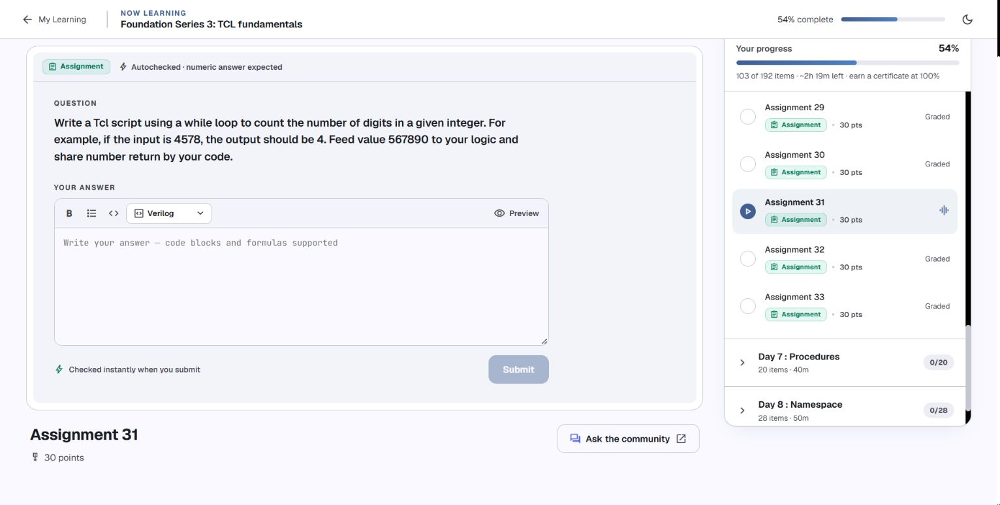

**What you need to produce:** the number of digits in the supplied integer, found using a `while` loop. The example result in the question explains the goal; apply your own loop to the required input.

**Approach.** Keep a working copy of the positive integer and a count initialized to zero. Each iteration removes one last digit with integer division by ten, and increases the count once. Continue while there are digits left in the working number. You do not need to build a reversed value or even retain the extracted digit for this task.

The invariant is simple: the count equals the number of digits removed so far. Division should eventually leave zero, making the condition false. If you forget the working-number update, the loop never advances; if you forget the increment, the loop advances but the result stays zero. Use braces around the loop’s changing condition so it is reevaluated after each update.

**Check your reasoning.** On separate positive inputs, a single-digit value should take one removal step, and multiplying a nonzero integer by ten should add one digit to its count. Zeros inside a number are still digits; this task does not count only nonzero digits. Avoid floating-point `/ 10.0`, which would shrink the value differently rather than remove one integer digit each time.

For a generalized implementation, zero is conventionally written with one digit even though a positive-number loop would execute zero times. A minus sign is not a digit, so negative inputs would require normalizing the sign before counting. These are additional checks for your logic, not changes to the question’s given positive input. Do not replace the requested `while` with only `string length`.

**Related lesson:** [while](day-6.md#repeat-with-while-and-a-changing-condition), [accumulator initialization](day-6.md#choose-an-accumulator-and-verify-loop-boundaries).

[← Back to ideas index](#index) · [← Main index](README.md#day-6)

### Assignment 32: Switch-selected sampling-rate multipliers

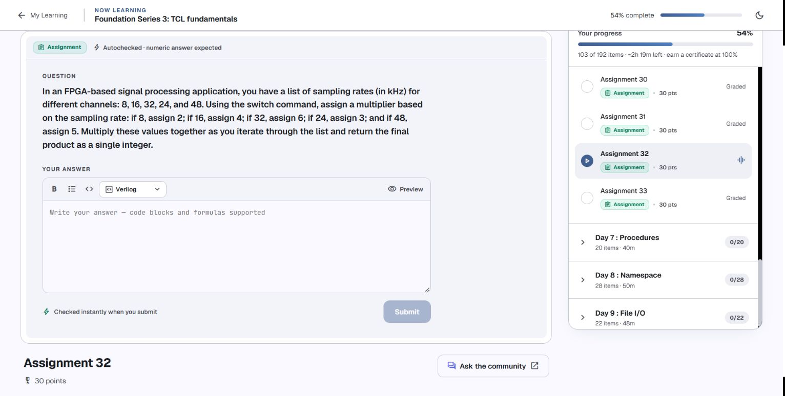

**What you need to produce:** choose the specified multiplier for each sampling rate with `switch`, then multiply the selected multipliers together. The product uses the assigned factors, not the sampling rates themselves.

**Approach.** Start the product at the multiplication identity. Visit each rate in the input list and let an exact-match switch assign the factor specified by that rate’s branch. After the switch finishes, perform one product update using the selected factor. This keeps the mapping in the switch and the accumulation in one common place.

Initialize the product to `1`, because any first factor multiplied by zero would produce zero and erase the intended calculation. Do not add the factors to a sum. Keep the rate variable, chosen multiplier, and product variable distinct so you can inspect which quantity each statement uses.

**Tcl details.** Use literal rate patterns and place each assignment inside its branch body. The separator `--` must be its own word before the input. A normal switch executes one matching branch and returns; it does not need a C-style `break`. Put `default` last and choose an explicit response to an unsupported practice rate. Quietly reusing the previous iteration’s factor is a common hidden error when no branch assigns a new one.

**Check your reasoning.** With separate practice data, verify that each supported rate selects the factor listed in the question. Trace rate, selected factor, product before the update, and product after it. One selected factor should produce that factor from the initial identity; a factor of one should leave a product unchanged. Every supplied rate should cause exactly one multiplication.

**Related lesson:** [exact switch matching](day-6.md#match-literal-values-with-switch), [product initialization](day-6.md#choose-an-accumulator-and-verify-loop-boundaries).

[← Back to ideas index](#index) · [← Main index](README.md#day-6)

### Assignment 33: Factorial with a loop

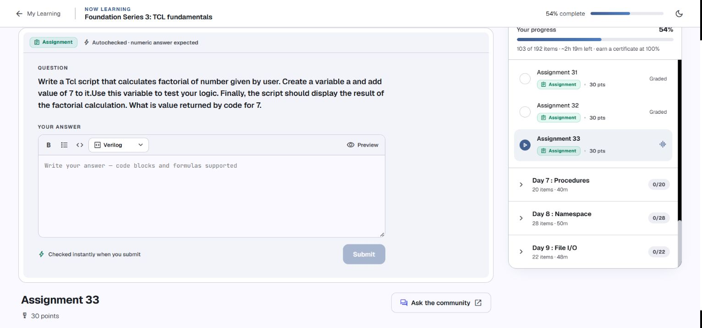

**What you need to produce:** assign the question’s input to `a`, calculate its factorial using a loop, and display the resulting integer. The product should be calculated by your loop rather than typed in as a known answer.

**Approach.** Keep the input separate from a factor counter and a product accumulator. Start the product at `1`, then visit successive positive factors through the input value, including the final factor. Multiply the product by the current factor on each iteration. A `for` expresses initialization, bound, update, and body together; a `while` works too if you explicitly initialize and advance the counter.

For a nonnegative integer $n$, the defining rule is:

$$
n!=\prod_{k=1}^{n}k,\qquad 0!=1.
$$

This makes two boundaries clear. Starting the product at zero would make every result zero. Stopping before the final factor would compute the product only through the previous integer. A factor counter starting at `1` is easy to inspect; starting at `2` is also valid when the product has already been initialized to one.

**Check your reasoning.** On separate small inputs, verify that after processing factor $k$, the accumulator equals the factorial through $k$. Multiplying that result by the next factor should extend the calculation by one step. An input of zero should leave the identity product unchanged under a suitable loop bound; negative input should be rejected or handled according to a stated policy rather than silently treated as a factorial here.

Use integer multiplication for this integer task, preserve `a` if you want to print the original input later, and print the final accumulator rather than the counter left after loop exit. Your corrected final `for {}` practice is syntactically valid; the [for-loop review](day-6.md#repeat-with-for-and-an-optional-initializer) explains its argument spacing and iteration order.

[← Back to ideas index](#index) · [← Main index](README.md#day-6)

## Sources and scope

The question images and [captured question text](internal/sources/day-4-6-assignment-questions.json) come from [Namaste FPGA, Foundation Series 3: Tcl fundamentals](https://namaste-fpga.com/student/learn/37?contentId=1801), read in Chrome on 5 October 2026. Select each assignment in the course outline: the shared course URL does not reliably encode the currently selected item.

Language behavior was checked against the official Tcl 8.6 manuals: [`array`](https://www.tcl-lang.org/man/tcl8.6/TclCmd/array.htm), [`if`](https://www.tcl-lang.org/man/tcl8.6/TclCmd/if.htm), [`switch`](https://www.tcl-lang.org/man/tcl8.6/TclCmd/switch.htm), [`while`](https://www.tcl-lang.org/man/tcl8.6/TclCmd/while.htm), and [`for`](https://www.tcl-lang.org/man/tcl8.6/TclCmd/for.htm). The matching day notes link the list, expression, and regular-expression references already used in the earlier reviews.

The saved original transcript is evidence of what you typed. Corrections in the notes are checked examples, not claims of submitted or completed assignments. This update stops at Day 6.

[← Back to ideas index](#index) · [← Back to the main index](README.md)
